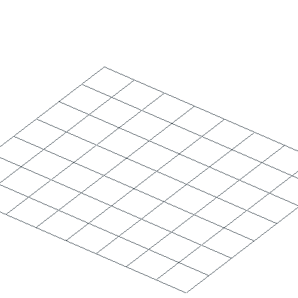

# Animation engine

A schematic describes a finished build. `BuildAnimation` adds a clock. It owns
the finished schematic while recording which mutations belong together, when
their effects start, and how the camera moves.

The timeline is plain data. Sampling it at time `t` returns group poses and a
camera pose. Rendering is a later stage, so JavaScript can record and inspect
an animation in WASM even though the native GPU and file encoders are not part
of that package.

## How the engine works

```text
set_block / operation calls
          │
          ├── update the owned schematic
          │
          └── record steps: positions + effect + order key + mesh snapshot
                                      │
                                      ▼
                  groups + clips + delays + camera tracks
                                      │
                              frame_at(time_ms)
                                      │
                       group poses + camera pose
                                      │
                  ┌───────────────────┴───────────────────┐
                  ▼                                       ▼
             JSON inspection                   mesh and native render
                                                │
                                      GIF / PNG frames / video
```

Four data types carry most of the design:

| Type | Job |
| --- | --- |
| `Group` | Positions that move as one draw target. |
| `Clip` | Property tracks, keyframes, easing, delay, and repetition. |
| `Stagger` | The order of groups and the delay between their starts. |
| `Frame` | The group poses and optional camera pose at one sampled time. |

`BuildAnimation` is the construction-shaped API used by the generated
bindings. `BuildAnimator` is the lower-level Rust API for regrouping an existing
schematic and editing its `Timeline` directly.

## Record construction

Each call outside an explicit group becomes one animation target. Calls between
`begin_group` and `end_group` share a target and start together. `with_effect`
applies to one target, while `set_default_effect` changes the fallback for every
later target.

=== "Python"

    ```python
    --8<-- "examples/readme/animation/engine.py:record"
    ```

=== "JavaScript"

    ```javascript
    --8<-- "examples/readme/animation/engine.mjs:record"
    ```

=== "Rust"

    ```rust
    --8<-- "tests/animation_docs_examples.rs:record"
    ```

The Rust tab is the body of a test that returns `Result<(), String>`. All three
versions record three groups: the five-block course, the diamond block, and the
furnace. The turntable is a camera target on the same timeline.

For geometry that should arrive along a curve, use `begin_keyed_group(key)` and
`set_stagger_total_ms(...)`. Custom effects use `AnimationEffect.create`,
`add_tween`, and `add_keyframe` in generated bindings.

## Sample the timeline

Sampling does not advance internal state. Asking for 450 ms twice returns the
same frame, and sampling later times before earlier ones does not change the
result.

=== "Python"

    ```python
    --8<-- "examples/readme/animation/engine.py:sample"
    ```

=== "JavaScript"

    ```javascript
    --8<-- "examples/readme/animation/engine.mjs:sample"
    ```

=== "Rust"

    ```rust
    --8<-- "tests/animation_docs_examples.rs:sample"
    ```

`frame_json` and `frameJson` expose the WASM-safe form. Rust returns a `Frame`
directly. A frame contains poses and camera data; the blocks remain in the
schematic and recorded mesh snapshots.

For a capture at `fps`, the engine derives each timestamp from its frame index.
It does not keep adding a rounded frame duration. A loop period samples
`[0, period)` and leaves out the duplicate endpoint.

## From frames to pixels

Native rendering has five stages:

1. Parse the resource-pack zip.
2. Mesh each recorded group from its stored schematic snapshot.
3. Sample the requested frames and optional final hold.
4. Create one GPU renderer, then update group-pose uniforms for each frame.
5. Encode RGBA frames as a GIF, numbered PNGs, or a video stream.

The mesh at index `i` belongs to animation group `i`. That alignment is the
contract between the timeline and renderer. A timed operation can therefore
move one group without rebuilding every other mesh.

`render_gif` performs the complete path in-process and writes an infinitely
looping GIF. `render_frames` writes numbered PNGs for an external compositor.
`render_video` streams frames to FFmpeg instead of retaining the complete frame
sequence.

## How the docs animations are generated

Every rendered example has a checked-in generator under
`examples/readme/<section>/`. The workshop generator uses the public Python API.
It records the build first:

```python
--8<-- "examples/readme/animation/workshop.py:record"
```

The camera and render configuration are ordinary data. `sphere_fit` keeps the
framing stable while groups arrive, and the fitted grid follows the build's
actual X/Z bounds.

```python
--8<-- "examples/readme/animation/workshop.py:camera"
```

The final section reads a resource pack, chooses output paths, renders the GIF,
and saves the schematic offered beside it.

```python
--8<-- "examples/readme/animation/workshop.py:output"
```

Run it from the repository root after placing a vanilla resource pack at
`render_work/pack.zip`:

```bash
.venv/bin/python examples/readme/animation/workshop.py
```

Set `NUCLEATION_PACK`, `NUCLEATION_OUT`, or `NUCLEATION_SCHEM_OUT` to use other
paths. The current generator produces 73 frames at 18 fps on a 420 by 420
canvas, including its final hold.

<figure markdown="span">
  { width="420" }
  <figcaption>The floor is one group. The furnace, table, chest, and armor stand are separate targets.</figcaption>
</figure>

[Download the generated workshop](../downloads/readme/animation/workshop.schem)

The docs verifier runs the Python, JavaScript, and Rust recorder examples. It
also regenerates the workshop in a temporary directory, checks the 73-frame
result and canvas size, and compares the generated schematic with the download:

```bash
./tools/verify-animation-docs.sh
```

## Binding support

| Capability | Python | JavaScript / WASM | Rust |
| --- | --- | --- | --- |
| Record groups, effects, camera, and operations | Yes | Yes | Yes |
| Sample frames | `frame_json` | `frameJson` | `frame_at` / `frames` |
| Inspect recorded operations | `operations_json` | `operationsJson` | typed receipts and operations |
| Render GIF, PNG frames, or video | Native methods | Not in the WASM package | Native renderer functions |
| Save the owned schematic to a path | Yes | Use exported bytes through the host | Yes |

JavaScript callers can consume frame JSON in their own renderer or send the
recorded build to a native service. The generated WASM class deliberately omits
native filesystem and GPU-render methods.

## Lower-level Rust timeline

```rust
use nucleation::animation::*;

let mut anim = BuildAnimator::from_schematic(&schem, Grouping::PerBlock);
anim.timeline_mut().add_staggered(
    presets::pop_in(200.0),                              // each block scales in
    &Stagger::each(Order::Axis(Axis::Y, true), 40.0),    // bottom to top, 40ms apart
    0.0,
);

for frame in anim.frames(30.0) {          // deterministic 30fps sampling
    for (id, pose) in &frame.poses {
        // pose.to_matrix() -> model matrix; pose.normal_matrix() -> normals
    }
}
```

Or skip the assembly and take a preset whole:

```rust
let anim = presets::assemble(&schem, 200.0, 40.0);
let anim = presets::print_layers(&schem, Axis::Y, 80.0);
```

## Ordering is the interesting part

Everything above is the same call with a different `Order`. That is the whole
design: *what moves* and *how it moves* stay fixed, and only the ranking changes.

| `Order` | Effect |
| --- | --- |
| `Index` | groups in the order they were built |
| `Axis(axis, ascending)` | bottom-up, top-down, left-to-right |
| `DistanceFrom(point)` | ripples outward from a point |
| `Key(Vec<f64>)` | any caller-supplied sort key |
| `Custom(Vec<usize>)` | an explicit permutation |
| `Random(seed)` | seeded shuffle: never unseeded |

`Key` is the general case, and two helpers produce the interesting keys.

### Along a shape's own curve

`ShapeEnum::parameter_at` gives the parametric `t` of a position along a line,
cylinder, cone, torus, pyramid or bezier: the same `t` a `curve_gradient` brush
uses to pick a colour. Feed it to the animator and blocks arrive in the order
the curve sweeps:

```rust
let anim = presets::along_shape(&schem, &shape, presets::drop_and_pop(300.0, 6.0), 2000.0);
```

A trefoil knot assembles itself head-to-tail instead of appearing all at once.

### In the order a brush painted them

Pass the sequence of placements and the animation replays the build:

```rust
let keys = presets::build_order_keys(&placement_sequence, anim.groups());
anim.timeline_mut().add_staggered(
    presets::pop_in(150.0),
    &Stagger::total(Order::Key(keys), 3000.0),
    0.0,
);
```

## Two easings, doing different jobs

This trips people up, so it is worth stating plainly:

- The easing inside a `Clip` shapes how a group moves once it starts.
- `Stagger::ease` shapes when each group starts: an accelerating or
  decelerating wave across the build.

```rust
Stagger::total(Order::Axis(Axis::Y, true), 2000.0)
    .from(StaggerFrom::Center)          // wave starts in the middle
    .eased(Easing::In(Power::Quad))     // and accelerates outward
```

`StaggerFrom` picks the origin: `First`, `Last`, `Center`, or `Index(n)`.

## Clips

A `Clip` bundles property tracks with timing.

```rust
let clip = Clip::new(400.0)
    .delay(100.0)
    .alternate(true)                    // ping-pong
    .repeat(Repeat::Times(3))
    .track(Track::tween(Property::Y, 8.0, 0.0, Easing::Out(Power::Cubic)))
    .track(Track::from_values(Property::RotZ, &[360.0, 0.0, -360.0], Easing::Linear));
```

Animatable properties: `X`/`Y`/`Z`, `RotX`/`RotY`/`RotZ` (degrees),
`ScaleX`/`ScaleY`/`ScaleZ`/`ScaleUniform`, `Opacity`, `TintR/G/B/A`,
`EmissiveR/G/B`.

A clip overrides only the channels it animates, so clips layer: one for
position, another for rotation, added independently.

Before its delay elapses a clip holds its first frame; after it finishes it
holds its last. Nothing snaps back.

### Easing curves

`Linear`; `In`/`Out`/`InOut` over `Quad`, `Cubic`, `Quart`, `Quint`, `Sine`,
`Expo`, `Circ`; `Back` and `Elastic` (which deliberately overshoot);
`Bounce`; `Steps(n)`; and `CubicBezier(x1, y1, x2, y2)` with the same
parameterisation as CSS, so any curve you can write there works here.

### Colours in one call

Tint and emissive take colour strings and expand to per-channel tracks, so one
name writes a compound value instead of three tracks at the call site:

```rust
Clip::new(600.0)
    .tint(&["#ff0000", "#00ff00", "#0000ff"], Easing::Linear)
    .emissive(&["#000000", "#ffcc00"], Easing::Out(Power::Cubic))
```

`#rgb`, `#rrggbb` and `#rrggbbaa` all parse, with or without the leading `#`.
An unparseable colour becomes neutral white rather than failing, so a typo dulls
a colour instead of killing the render.

`Pose::opacity` folds into tint alpha at draw time, so there is a single alpha
source rather than two that can disagree.

### Modifiers

A `Modifier` post-processes a track's value: `SinCosBounce` drives the
`0.5 · (|sin v| + |cos v|)` arc when a track sweeps `0..4π`:

```rust
Track::tween(Property::Y, 0.0, 4.0 * std::f32::consts::PI, Easing::Linear)
    .with_modifier(Modifier::SinCosBounce)
```

Modifiers are a fixed set rather than callbacks, because closures cannot cross
the language bindings. Rust callers wanting arbitrary maths should pre-bake
keyframes instead.

## Grouping and cost

| `Grouping` | Unit | Notes |
| --- | --- | --- |
| `PerBlock` | one block | highest resolution, highest draw cost |
| `Layer(axis)` | one slice | the printer effect |
| `Chunk(n)` | an n³ cube | good default for large builds |
| `Custom(sets)` | whatever you pass | |

Greedy meshing batches geometry by `(texture, AO pattern)`, so splitting a build
per block changes material batching and raises draw counts. Use `PerBlock`
for hero shots of hundreds to low thousands of blocks; use `Layer` or `Chunk`
for anything large. Measure before relying on it.

Air is never grouped: air is absence, not a block.

## The camera is on the same clock

Target `Camera` and the clip drives the view instead of geometry, so an orbit
and an assembly share one timeline:

```rust
anim.timeline_mut().add(presets::turntable(4000.0), Target::Camera, 0.0);
```

The mapping is: `RotY → yaw`, `RotX → pitch`, `ScaleUniform → zoom`,
`X`/`Y`/`Z` → orbit target offset.

## Anchors

An anchor is a named point on one animation group. Record it on the open group
or the most recent one with `addAnchor(name, x, y, z)`, or on any group with
`addAnchorToGroup(group, name, x, y, z)`. Coordinates are the block coordinates
poses use, so `[4.5, 2.0, 0.5]` is the top-centre of the block at `(4, 1, 0)`.

Every frame carries `anchors: [{ name, group, world, opacity }]`: the point
after its group's pose at that instant, plus the group's opacity. The engine
only transforms anchors; what to draw at one — a hotspot, a label, a leader
line that lands with the block — is the renderer's decision.

=== "Python"

    ```python
    --8<-- "examples/readme/animation/engine.py:anchors"
    ```

=== "JavaScript"

    ```javascript
    --8<-- "examples/readme/animation/engine.mjs:anchors"
    ```

`anchorsJson()` lists the declarations (`name`, `group`, `local`). Names are
unique per animation.

## Determinism

`Timeline::seek` is pure: no interior mutation, no wall-clock. The same time
always yields the same frame, sampling out of order changes nothing, and
`Order::Random` is seeded with no unseeded variant.

Frame times come from `i × 1000 ÷ fps` computed in `f64`, so they do not drift
the way accumulated sums would.

The sampled timeline is reproducible. Encoded media also depends on the exact
resource pack, renderer version, and encoder version. The docs verifier checks
the generated build, frame count, and canvas instead of assuming files from
different tool versions have the same byte hash.

## Pivots

A group's pose pivots about its centroid by default, which is what makes
"scale in place" work without any arithmetic at the call site. Override
`Pose::pivot` to swing a group about a hinge instead.

`Pose::normal_matrix()` returns the inverse-transpose used for shading normals.
Renderers must apply it: skip it and rotated geometry shades wrong in a way
that reads as a lighting bug. Degenerate poses (a block at scale 0 mid-reveal)
return identity rather than emitting NaNs.

## Rendering it

Three calls: group, mesh per group, render.

```rust
use nucleation::animation::{presets, Axis, BuildAnimator, Grouping, Order, Stagger, Target};
use nucleation::rendering::{render_animation_to_files, RenderConfig};

let mut anim = BuildAnimator::from_schematic(&schem, Grouping::PerBlock);
anim.timeline_mut().add_staggered(
    presets::drop_and_pop(420.0, 6.0),
    &Stagger::each(Order::Axis(Axis::Y, true), 55.0),
    0.0,
);
let spin = presets::turntable(anim.duration_ms());
anim.timeline_mut().add(spin, Target::Camera, 0.0);

// One MeshOutput per group, index-aligned: this is the contract.
let meshes = schem.mesh_groups(&pack, &MeshConfig::default(), anim.groups())?;

let mut rc = RenderConfig::isometric();
rc.sphere_fit = true;          // steady framing while the camera orbits
render_animation_to_files(&meshes, &anim.frames(24.0), &rc, None, "out/f")?;
```

This writes numbered PNGs. Assemble those frames with FFmpeg when an external
compositor or a different media format is required.

### Transparent GIFs from PNG frames

Set an alpha-0 clear and the frames drop into a README on light *or* dark
backgrounds:

```rust
rc.background = Some([0.0, 0.0, 0.0, 0.0]);
```

GIF has 1-bit transparency: a pixel is fully opaque or fully gone. That
would normally fringe antialiased edges, but the renderer does not multisample
(`count: 1`), so edges are hard-cut and the cutout is clean. Two ffmpeg flags do
the work:

```bash
ffmpeg -y -framerate 24 -i 'out/f%04d.png' \
  -vf "split[a][b];[a]palettegen=max_colors=200:reserve_transparent=1[p];\
[b][p]paletteuse=alpha_threshold=128" \
  -loop 0 out.gif
```

`reserve_transparent=1` keeps a palette slot for the transparent colour;
`alpha_threshold=128` picks the opaque/clear cutoff. Omit either and the
background comes back as solid black.

For full 8-bit alpha, APNG is the alternative. GitHub renders it:

```bash
ffmpeg -y -framerate 24 -i 'out/f%04d.png' -plays 0 -f apng out.png
```

Keep docs animations small: reduce the frame rate, shrink the canvas, and lower
`max_colors`. File size depends heavily on camera movement and palette changes.

`mesh_groups` is what keeps mesh *i* aligned with group *i*: groups that
contain only air still produce an entry so the indices never slip.

The GPU renderer, atlas, and geometry buffers are built once and reused for
every frame. Only the pose uniforms change, which avoids reconstructing the
renderer for a sequence of independent stills.

`examples/render_animation.rs` is the runnable version of the above.

### What rendering costs

Each group is meshed independently, so faces remain between adjacent groups.
Those faces become necessary when groups move apart and cost extra when the
groups stay together. Per-block grouping also means one draw call per block.
Prefer `Layer` or `Chunk` for large builds.

## Reference grid and axes

For coordinate-space clarity, the renderer can draw a world-space grid on the
ground plane with optional coloured axes (+X red, +Y green, +Z blue):

```rust
use nucleation::rendering::GridConfig;
rc.grid = Some(GridConfig {
    fit_to_bounds: true,       // rectangular grid around actual block bounds
    margin: 1,                 // one complete grid cell around the build
    spacing: 1,                // one cell per block; lines use n ± 0.5 boundaries
    plane_y: -0.502,           // below y=0 floor blocks, whose bottom is -0.5
    show_axes: false,
    line_rgba: [0.42, 0.52, 0.60, 0.26],
    ..GridConfig::default()
});
```

The fitted form uses `floor(min)` and `ceil(max)` from the rendered geometry,
so an asymmetric build does not receive a misleading origin-centred square.
Every line remains on a half-integer boundary and therefore meets the edges of
block models centred on integer coordinates. When axes are enabled, their origin
marker is block-aligned at `(-0.5, plane_y, -0.5)`, the minimum X/Z corner of
block `(0, 0, 0)`, rather than piercing that block's centre. In generated
bindings, call
`RenderConfig.set_fitted_grid(margin, spacing, plane_y, ...)`.

## Screen-space overlays (labels, leader lines, code)

Text and 2D chrome live in a `compositor`, outside the 3D renderer. This keeps a
heavy text-rendering dependency out of the library. The renderer's job is to
say *where on screen* a block is; the compositor draws the callout.

```rust
use nucleation::rendering::{animation_view_projs, camera::project_point};

let view_projs = animation_view_projs(&meshes, &frames, &rc);   // GPU-free
// For frame i, the pixel position of the block centre at (2, 2, 2):
if let Some((px, py)) = project_point(&view_projs[i], [2.5, 2.5, 2.5], rc.width, rc.height) {
    // hand (px, py) to an SVG/ffmpeg overlay step
}
```

`examples/readme/animation/assemble.rs` writes these anchors to `anchors.json`; a
compositor then draws a leader line and caption that track the block frame by
frame. A 2D screen-space grid is the same idea: evenly spaced lines drawn by
the compositor.

## Presets

| Preset | What it does |
| --- | --- |
| `pop_in(ms)` | scale 0→1 with a slight overshoot |
| `drop_in(ms, height)` | fall into place, decelerating |
| `drop_and_pop(ms, height)` | both together |
| `spin_in(ms, turns)` | spin while scaling in |
| `turntable(ms)` | a full camera orbit |
| `assemble(schem, ms, each)` | bottom-to-top reveal |
| `print_layers(schem, axis, ms)` | layer-by-layer print |
| `along_shape(schem, shape, clip, ms)` | reveal along a curve |

Presets return ordinary `Clip`s and `BuildAnimator`s: keep editing the timeline
if one is nearly right.
