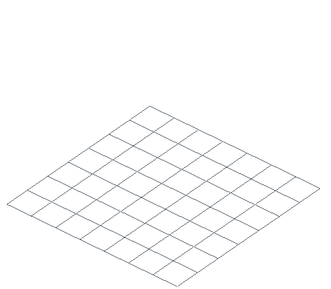

# Basics

A `Schematic` is Nucleation's editable model: blocks, entities, block entities,
metadata, and one or more regions. Start empty or open an existing build, edit it
with ordinary Minecraft block-state strings, inspect the result, then save it in
the format you need.

This page uses Python for clarity. The generated bindings expose the same model
and operations in every supported language.

## Build a crafting nook

<table>
<tr>
<td width="53%" valign="top"><pre><code>from nucleation import Schematic
nook = Schematic.create("crafting_nook")
for x in range(5):
    for z in range(5):
        nook.set_block(x, 0, z, "minecraft:spruce_planks")
nook.set_block(1, 1, 1, "minecraft:crafting_table")
nook.set_block(3, 1, 1, "minecraft:chest[facing=west]")
nook.set_block(0, 2, 4, "minecraft:wall_torch[facing=east]")
nook.save_to_file("crafting-nook.schem")
copy = Schematic.load_from_file("crafting-nook.schem")
block = copy.get_block(1, 1, 1)
print(block.name())  # minecraft:crafting_table</code></pre></td>
<td width="47%" valign="top" align="center"></td>
</tr>
</table>

[View the complete working generator](../../examples/readme/basics/generate.py) ·
[Download the generated crafting nook](../downloads/readme/basics/crafting-nook.schem)

The complete script is the source of truth for both artifacts. It builds the
schematic, saves the downloadable `.schem`, configures the camera and animation,
and renders the GIF shown above.

To regenerate the media locally, point it at a Minecraft resource-pack ZIP:

```bash
NUCLEATION_PACK=/path/to/resource-pack.zip \
  python examples/readme/basics/generate.py
```

By default it writes to the section-scoped locations used by this page:

```text
examples/readme/basics/generate.py
├── docs/media/readme/basics/animation.gif
└── docs/downloads/readme/basics/crafting-nook.schem
```

## Coordinates and automatic growth

Coordinates are signed integers in Minecraft order: **X, Y, Z**. Positive Y is
up. A newly created schematic does not need dimensions up front: placing a block
automatically grows the default region to contain it, including negative
coordinates.

```python
build = Schematic.create("negative_coordinates")
build.set_block(-8, 64, 12, "minecraft:stone")
build.set_block(24, 80, -3, "minecraft:glass")
```

Setting the same coordinate again replaces the previous state. Set
`minecraft:air` to remove a block.

## Block-state strings

Use the same namespaced block-state syntax used by commands and structure files:

```text
minecraft:stone
minecraft:oak_log[axis=x]
minecraft:oak_stairs[facing=east,half=bottom,shape=straight]
minecraft:water[level=0]
```

Properties are part of the state, so orientation and variants survive format
round-trips. Use `BlockState` directly when you need to construct or inspect
properties programmatically.

## Inspect blocks

`get_block(x, y, z)` returns the complete `BlockState`:

```python
state = build.get_block(1, 1, 1)
print(state.name())
print(state.to_string())
```

For lighter-weight queries, use `get_block_name` or `get_block_string`. A lookup
outside every region returns a `NotFound` error.

## Open and save

Nucleation infers formats from file extensions:

```python
from nucleation import Schematic

build = Schematic.load_from_file("castle.litematic")
build.set_block(0, 64, 0, "minecraft:gold_block")
build.save_to_file("castle-edited.schem")
```

The same model can also load from and save to bytes for servers, databases, and
object storage. See [Formats and I/O](formats-and-io.md) for format detection,
conversion, byte APIs, and round-trip guarantees.

## Next

- [Formats and I/O](formats-and-io.md)
- [Shapes, brushes, and masked fills](shapes-and-brushes.md)
- [Animating a build](animation.md)
