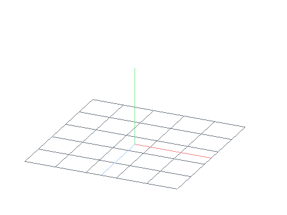
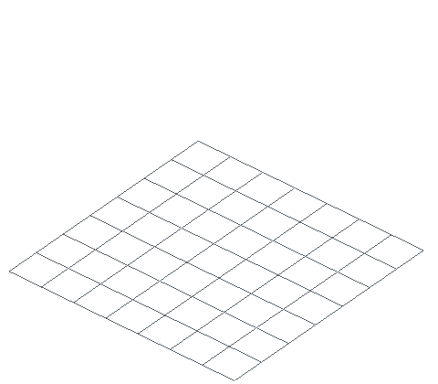
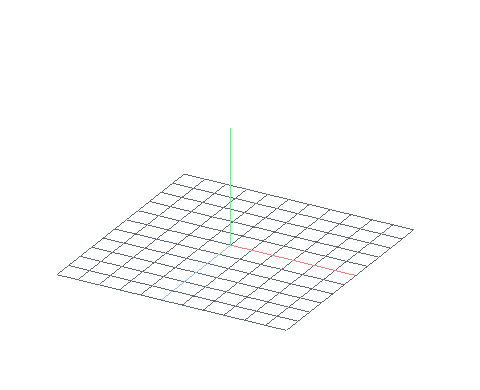

# Basics

A `Schematic` is an editable Minecraft build. It holds blocks, block entities,
entities, metadata, and one or more regions. Start with an empty schematic or
load one from bytes or a file. Coordinates and block-state strings stay the
same when the output format changes.

The Python, JavaScript, and Rust tabs below are cut directly from executable
examples in the repository. The [verification command](#verified-examples) runs
all three versions and checks their block counts, bounds, states, simulation
result, and file round trips.

Rust tabs show the body of a `main` function that returns
`Result<(), Box<dyn std::error::Error>>`, matching the executable source.

## Build a beacon

This first build places a 3 by 3 gold base around the origin, adds the beacon at
`(0, 1, 0)`, and writes a Sponge schematic. The result has 10 non-air blocks and
tight dimensions of `3 × 2 × 3`.

=== "Python"

    ```python
    --8<-- "examples/readme/basics/basics.py:beacon"
    ```

=== "JavaScript"

    ```javascript
    --8<-- "examples/readme/basics/basics.mjs:beacon"
    ```

=== "Rust"

    ```rust
    --8<-- "examples/readme/basics/rust/src/main.rs:beacon"
    ```

The JavaScript package is WASM, so it returns encoded bytes instead of writing
to a filesystem. The example decodes those bytes in Node. In a browser, pass
the resulting `Uint8Array` to a download, upload, or storage API.

<figure markdown="span">
  { width="480" }
  <figcaption>Nine gold blocks arrive in loop order, followed by the beacon.</figcaption>
</figure>

[Download the generated beacon](../downloads/readme/basics/beacon.schem)

## Build something with states

The crafting nook uses loops for the floor and walls, then places blocks whose
state matters: upright stripped logs, a south-facing chest, and wall torches
attached in two directions.

=== "Python"

    ```python
    --8<-- "examples/readme/basics/basics.py:crafting-nook"
    ```

=== "JavaScript"

    ```javascript
    --8<-- "examples/readme/basics/basics.mjs:crafting-nook"
    ```

=== "Rust"

    ```rust
    --8<-- "examples/readme/basics/rust/src/main.rs:crafting-nook"
    ```

<figure markdown="span">
  { width="480" }
  <figcaption>The floor, walls, furniture, and torches are separate construction groups.</figcaption>
</figure>

[Download the generated crafting nook](../downloads/readme/basics/crafting-nook.schem)

## Coordinates and bounds

Coordinates are signed integers in Minecraft order: `X`, `Y`, `Z`. Positive Y
is up. Placing outside the current region grows it to include the new position,
including negative coordinates.

=== "Python"

    ```python
    --8<-- "examples/readme/basics/basics.py:coordinates"
    ```

=== "JavaScript"

    ```javascript
    --8<-- "examples/readme/basics/basics.mjs:coordinates"
    ```

=== "Rust"

    ```rust
    --8<-- "examples/readme/basics/rust/src/main.rs:coordinates"
    ```

The minimum and maximum are inclusive, which is why X spans 33 blocks from
`-8` through `24`. Tight bounds describe placed, non-air content. Allocated
dimensions describe internal region storage and can be larger, especially when
a build crosses the origin. Use tight bounds when you mean the visible build.

<figure markdown="span">
  { width="480" }
  <figcaption>Gold marks the origin. Red and blue mark ±X, orange and purple mark ±Z, and green marks +Y.</figcaption>
</figure>

## Read, replace, and remove blocks

A block-state string is a namespaced block name followed by optional properties:

```text
minecraft:stone
minecraft:oak_log[axis=x]
minecraft:oak_stairs[facing=east,half=bottom,shape=straight]
minecraft:water[level=0]
```

Properties are part of the state, so orientation and variants survive format
round trips. Setting a coordinate again replaces its previous state. Setting
`minecraft:air` removes the block.

=== "Python"

    ```python
    --8<-- "examples/readme/basics/basics.py:block-states"
    ```

=== "JavaScript"

    ```javascript
    --8<-- "examples/readme/basics/basics.mjs:block-states"
    ```

=== "Rust"

    ```rust
    --8<-- "examples/readme/basics/rust/src/main.rs:block-states"
    ```

Python and JavaScript raise `NotFound` when a lookup is outside every region.
Rust's core `get_block` returns `None`. Use `BlockState` directly when you need
to construct or inspect properties one at a time.

## Content shorthands

Common container and jukebox contents have compact shorthands. They create the
required NBT as the block is placed.

=== "Python"

    ```python
    --8<-- "examples/readme/basics/basics.py:contents"
    ```

=== "JavaScript"

    ```javascript
    --8<-- "examples/readme/basics/basics.mjs:contents"
    ```

=== "Rust"

    ```rust
    --8<-- "examples/readme/basics/rust/src/main.rs:contents"
    ```

`signal=0..15` fills a container for the requested comparator strength. Add
`item=` to choose the filler. In `items=[...]`, entries occupy consecutive
slots, `*count` defaults to one, and bare item names receive the `minecraft:`
namespace. A jukebox accepts either `record=` or `signal=`. See [Blocks,
entities, and NBT](block-entities-nbt.md) when you need explicit NBT.

## Place through the tick engine

The `{simulate=true}` tag runs the placement through the tick engine. The engine
derives neighbour connections, runs the block's placement behaviour, and writes
the resulting state back. Here the wire arrives connected and powered instead
of keeping a generic default state.

=== "Python"

    ```python
    --8<-- "examples/readme/basics/basics.py:simulation"
    ```

=== "JavaScript"

    ```javascript
    --8<-- "examples/readme/basics/basics.mjs:simulation"
    ```

=== "Rust"

    ```rust
    --8<-- "examples/readme/basics/rust/src/main.rs:simulation"
    ```

The tag must be the only item inside the braces. Published Python and
JavaScript packages include the tick engine. Rust builds need the `bridge` and
`mc-tick` features. See [placing through the engine](tick-simulation.md#placing-through-the-engine)
for component-scoped and full-world placement.

## Open, edit, and save

Python chooses a writer from the output extension. JavaScript reads and writes
bytes through the host environment. Rust's `UniversalSchematic` exposes format
modules and byte encoders directly.

=== "Python"

    ```python
    --8<-- "examples/readme/basics/basics.py:io"
    ```

=== "JavaScript"

    ```javascript
    --8<-- "examples/readme/basics/basics.mjs:io"
    ```

=== "Rust"

    ```rust
    --8<-- "examples/readme/basics/rust/src/main.rs:io"
    ```

The JavaScript example uses the `readFileSync`, `writeFileSync`, and
`bytesFromBase64` definitions from the first tab. See [Formats and
I/O](formats-and-io.md) for format detection, version selection, all byte APIs,
and round-trip guarantees.

## Animations are generated, too

The three illustrations on this page are rendered from schematics by
`BuildAnimation`. They are not hand-authored mockups. The checked-in generators
record construction groups, set a camera and grid, and render GIF frames with a
Minecraft resource pack. Python and JavaScript expose the generated
`BuildAnimation` API; Rust also exposes the underlying animation builder and
rendering modules.

Start with [Animating a build](animation.md) for effects, grouping, camera
tracks, GIF output, and video assembly. The page generators live beside the
executable examples in `examples/readme/basics/`.

## Verified examples

Run every source embedded above with one command from the repository root:

```bash
./tools/verify-basics-docs.sh
```

The verifier runs each language in a clean temporary directory. It checks exact
bounds and block counts, confirms the block-state and simulated-wire results,
and opens the generated schematic before writing it again. The documentation
build then expands the marked regions from those same files into this page, so
the displayed code and executed code cannot drift independently.

## Next

- [Formats and I/O](formats-and-io.md)
- [Shapes, brushes, and masked fills](shapes-and-brushes.md)
- [Animating a build](animation.md)
