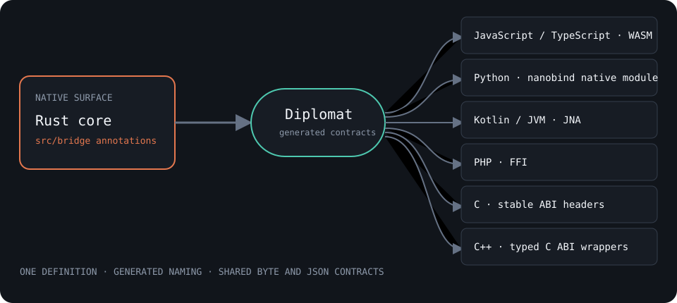
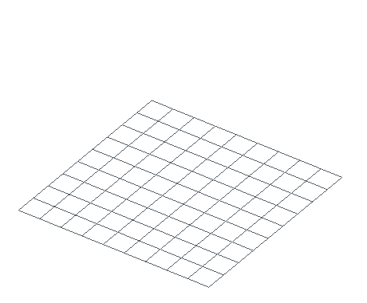

# Bindings and languages

Nucleation has one native Rust model and six generated foreign-language
bindings. The annotations in `src/bridge/` define the shared API. Diplomat
generates JavaScript/TypeScript, Python, Kotlin/JVM, PHP, C, and C++ from those
definitions.



Generated files are committed. Release CI regenerates them twice, checks that
both passes are identical, and refuses any diff from the committed bindings.
This tests API drift at the source instead of maintaining seven handwritten
method lists.

## Choose a package

| Language | Install or artifact | Runtime shape | Method naming |
| --- | --- | --- | --- |
| Rust | `cargo add nucleation` | native crate | `set_block_from_string` |
| Python | `pip install nucleation` | CPython stable-ABI wheel | `set_block` |
| JavaScript / TypeScript | `npm install nucleation` | ESM plus WebAssembly | `setBlock` |
| Kotlin / JVM | release JAR | JNA plus bundled native libraries | `setBlock` |
| PHP | release archive | PHP FFI plus native library | `setBlock` |
| C | release archive | C headers plus native library | `Schematic_set_block` |
| C++ | release archive | typed headers over the C ABI | `set_block` |

The current release matrix builds native artifacts for Linux x86-64 and ARM64,
macOS x86-64 and Apple Silicon, and Windows x86-64. The npm package targets
Node 18 or later and browser bundlers.

## The same build in three primary bindings

These programs build an 84-block stack and assert the same bounds. Each then
writes a Sponge schematic for the verifier.

=== "Python"

    ```python
    --8<-- "examples/readme/bindings-and-languages/bindings.py:build"
    ```

=== "JavaScript"

    ```javascript
    --8<-- "examples/readme/bindings-and-languages/bindings.mjs:build"
    ```

=== "Rust"

    ```rust
    --8<-- "examples/readme/bindings-and-languages/rust/src/main.rs:build"
    ```

<figure markdown="span">
  { width="460" }
  <figcaption>Different naming conventions reach the same fill and palette-write implementation.</figcaption>
</figure>

[Download the exact generated stack](../downloads/readme/bindings-and-languages/binding-stack.schem)

Rust exposes concrete core types such as `UniversalSchematic`. Generated
bindings expose opaque handles such as `Schematic`; the native or WASM module
owns the Rust value behind each handle. This is why the operations agree even
when their host-language types look different.

## What crosses a binding boundary

The shared bridge uses a small set of explicit representations:

| Value | Boundary representation | Why |
| --- | --- | --- |
| Names and block descriptors | UTF-8 strings | Readable and stable across every host |
| Input files | byte arrays | Format detection reads content directly |
| Output files | base64 strings in generated bindings | Safe through FFI and WASM string returns |
| Structured reports | JSON strings | One schema for Python, JS, JVM, PHP, C, and C++ |
| Large domain objects | opaque handles | Avoid copying schematics, meshes, and simulations |
| Small coordinates and dimensions | generated value types or flat arrays | Cheap to copy and easy to validate |

JSON results are contracts, not debug strings. For example, transformation
reports, block-entity records, diff summaries, and simulation changes keep the
same field names in every language. Parse them with the host JSON library.

JavaScript receives binary output as base64:

```javascript
const bytes = Uint8Array.from(
  Buffer.from(stack.toSchematicB64(), "base64"),
);
```

Python can use native file methods or decode the same shared output:

```python
from base64 import b64decode

payload = b64decode(stack.to_schematic_b64())
```

Rust returns `Vec<u8>` from its native serializers and does not need the
base64 bridge.

## Errors follow the host language

The operation and error meaning stay shared; presentation follows local
conventions.

| Surface | Error form |
| --- | --- |
| Rust | `Result<T, E>` |
| Python | exceptions |
| JavaScript | exceptions |
| Kotlin | `kotlin.Result` wrappers |
| PHP | `DiplomatError` |
| C | tagged result structs |
| C++ | `diplomat::result` |

Generated bindings also retain a detail string for failures whose enum category
is too broad on its own. A tick simulation can report the unsupported block and
coordinate, for example, while still returning the shared `Simulation` error
category.

## Feature availability depends on the artifact

The generated source contains the complete bridge surface, but a binary can
only call features compiled into that artifact.

| Artifact | Included feature set |
| --- | --- |
| PyPI wheel | `bridge-full`: simulation, tick engine, meshing, renderer, scripting, voxelization, routing, HDL, and world segmentation |
| Native release library / JVM JAR | `bridge-full` on the five native targets |
| npm package | core bridge, tick engine, and meshing; no GPU renderer, embedded scripting, native filesystem, or MCHPRS |
| crates.io crate | normal native core plus publishable optional features; MCHPRS, `mc-tick`, routing, and HDL are stripped because their dependencies are not all registry-published |
| Git dependency or source checkout | every repository feature can be selected explicitly |

For MCHPRS in Rust, use the repository dependency and enable `simulation`:

```toml
nucleation = { git = "https://github.com/Schem-at/Nucleation", features = ["simulation"] }
```

For a custom WASM package, set `NUCLEATION_WASM_FEATURES` before running
`tools/package-npm.sh`. GPU rendering remains native because its backend does
not use the generated WebAssembly module.

## Foreign-language quickstarts

The less common bindings ship in the native release archive or JVM JAR. Their
minimum construction calls are:

=== "Kotlin"

    ```kotlin
    import at.schem.nucleation.*

    val schematic = Schematic.create("demo")
    schematic.setBlock(1, 2, 3, "minecraft:stone").getOrThrow()
    println(schematic.getBlockName(1, 2, 3).getOrThrow())
    ```

=== "PHP"

    ```php
    <?php
    require "php/index.php";
    use Stencil\Lib;
    use Stencil\Schematic;

    Lib::init("/path/to/libnucleation.so");
    $schematic = Schematic::create("demo");
    $schematic->setBlock(1, 2, 3, "minecraft:stone");
    ```

=== "C"

    ```c
    #include "Schematic.h"

    int main(void) {
        DiplomatStringView name = {"demo", 4};
        Schematic *schematic = Schematic_create(name);
        DiplomatStringView stone = {"minecraft:stone", 15};
        Schematic_set_block_result placed =
            Schematic_set_block(schematic, 1, 2, 3, stone);
        if (!placed.is_ok) return 1;
        Schematic_destroy(schematic);
        return 0;
    }
    ```

The release workflow compiles and runs C, C++, PHP, JavaScript, and Python smoke
programs against generated output. It separately assembles the JVM JAR, loads
its bundled native library, and runs a Kotlin smoke program. The runnable
sources live in [`examples/bridge_smoke`](https://github.com/Schem-at/Nucleation/tree/master/examples/bridge_smoke).

## Type information and lifecycle

The npm package includes `.d.ts` and `.d.mts` declarations. Python wheels carry
`py.typed` and generated `.pyi` stubs for Mypy, Pyright, and editor completion.
Kotlin and C++ expose generated typed wrappers; C is the stable lowest-level
ABI.

Opaque values should not be used after their host wrapper is closed or
destroyed. C owns this explicitly through `*_destroy`. Managed bindings attach
destruction to their wrapper lifecycle, but releasing large schematics,
simulations, or meshes promptly still reduces native or WASM memory pressure.

## Verify the guide

The verifier executes the Python, JavaScript, and Rust sources, checks an exact
diff distance of zero between all three exports, and regenerates the still,
download, and 57-frame animation.

```bash
./tools/verify-bindings-docs.sh
```

The full cross-language generator and smoke suite belongs to the release
workflow because it needs a compiler, PHP FFI, a JVM, WebAssembly, and five
native target builds. The page verifier covers the three everyday entry points
on each documentation change.
