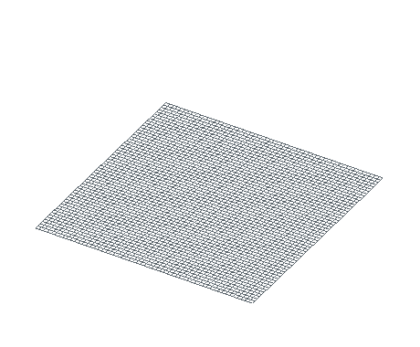
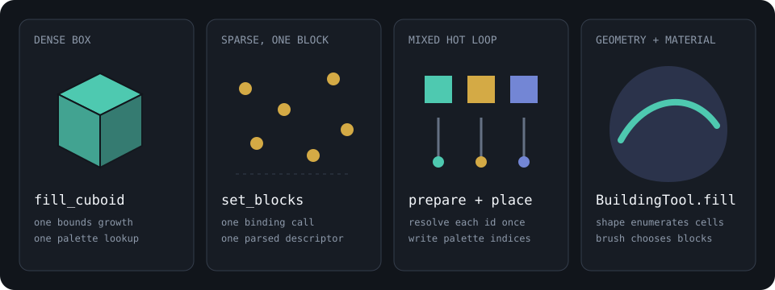

# Fast schematic generation

Large builds become slow when generation code crosses a language boundary for
every block or repeatedly grows the same region. Nucleation exposes several
write paths because a dense box, a sparse point set, and a mixed-material loop
have different costs.

The example below contains 6,926 blocks. Its foundation is one cuboid fill, the
lighting grid is one sparse batch, and the towers use three palette indices
resolved before the loop. The animation treats those batches as construction
units; the downloadable schematic is generated by the bulk APIs themselves.

<figure markdown="span">
  { width="460" }
  <figcaption>Sixteen logical batches assemble the same cells written by the fast-generation example.</figcaption>
</figure>

[Download the generated campus](../downloads/readme/fast-generation/bulk-campus.schem)

## Match the operation to the data



| Input | Preferred operation | Work kept outside the inner loop |
| --- | --- | --- |
| One axis-aligned box, one block | `fill_cuboid` | bounds growth and palette lookup |
| Many coordinates, one descriptor | `set_blocks` | binding calls, validation, bounds growth, descriptor parsing |
| Many coordinates, several plain block IDs | `prepare_block` + `place` | repeated name-to-palette lookup |
| A shape combined with material logic | `BuildingTool.fill` | host-language coordinate lists |
| A single unusual edit | `set_block` | nothing; clarity is more useful here |

Bulk operations reduce fixed work. They do not change the number of cells that
must be stored, and a brush still has to evaluate every candidate coordinate in
its shape bounds.

## One build in three bindings

These programs produce cell-exact equivalent Sponge schematics. Language
bindings expose `Schematic`; Rust uses `UniversalSchematic` and can work with
the region palette directly.

=== "Python"

    ```python
    --8<-- "examples/readme/fast-generation/fast_generation.py:build"
    ```

=== "JavaScript"

    ```javascript
    --8<-- "examples/readme/fast-generation/fast_generation.mjs:build"
    ```

=== "Rust"

    ```rust
    --8<-- "examples/readme/fast-generation/rust/src/main.rs:build"
    ```

The JavaScript batch is a flat `[x, y, z, ...]` array. One method call carries
all 68 light positions across the WASM boundary. Python uses the same flat
layout. Rust already runs beside the storage layer, so its example pre-sizes
the region and writes resolved palette indices directly.

## Verify the result, not the loop

A large generator should assert properties of its artifact before saving it.
Block count catches missing writes, tight dimensions catch coordinate mistakes,
and a few deliberate probes catch material-selection errors.

=== "Python"

    ```python
    --8<-- "examples/readme/fast-generation/fast_generation.py:inspect"
    ```

=== "JavaScript"

    ```javascript
    --8<-- "examples/readme/fast-generation/fast_generation.mjs:inspect"
    ```

=== "Rust"

    ```rust
    --8<-- "examples/readme/fast-generation/rust/src/main.rs:inspect"
    ```

The page verifier goes further: it exports all three programs, loads their
files, and compares the schematics with the `exact` diff preset.

## What each fast path does

### Dense cuboids

`fill_cuboid` normalizes its two corners, expands the default region once,
resolves the block once, and fills contiguous rows. Use it for foundations,
walls, clearing volumes with air, and other uniform boxes.

Calling `set_block` for the same rectangular volume asks the binding and region
to handle each coordinate separately. The result is equivalent, but the call
shape discards information the cuboid writer could have used.

### Sparse batches

`set_blocks` accepts one block descriptor and a flat coordinate array. It
validates the complete array before mutation, scans its bounds, expands the
region once, and reuses the parsed descriptor. Properties and NBT shorthands
remain available:

```python
positions = [0, 4, 0,  8, 4, 0,  16, 4, 0]
build.set_blocks(positions, "minecraft:barrel{signal=13,item=iron_ingot}")
```

Every position receives an independent block entity. For millions of sparse
coordinates, send bounded batches instead of retaining one enormous host-side
list. Choose batches large enough that boundary crossings are a small part of
the work.

### Pre-resolved palette placement

`prepare_block` returns the default region's palette index for a plain block
ID. `place` writes that index without another name lookup. This suits procedural
loops whose material varies per coordinate.

Palette indices belong to the schematic and region that produced them. Do not
reuse an index with another schematic. The path also bypasses property and NBT
parsing, so use `set_block` or `set_blocks` for descriptors containing `[...]`
or `{...}`.

Rust callers can make the same optimization explicitly with
`ensure_bounds`, `get_or_insert_palette_by_name`, and
`set_block_at_index_unchecked`. The last method assumes the palette index and
coordinates were validated by the caller, which is why the example fixes the
complete bounds first.

### Shapes and brushes

`BuildingTool.fill` keeps geometric enumeration inside Nucleation. A `Shape`
chooses candidate cells and a `Brush` chooses their blocks. This avoids building
a large coordinate array in Python or JavaScript and supports gradients,
palette matching, masks, and signed-distance fields.

Use [Shapes and brushes](shapes-and-brushes.md) when the input is geometric
rather than an existing point list.

## Bounds are part of the memory model

A region covers an allocated cuboid. Two blocks placed very far apart can
therefore allocate the volume between them even when most of it is air. Keep
distant structures in separate regions or process them through the
[streaming and worlds](streaming-and-worlds.md) APIs.

For a known dense build, establish its bounds before a palette-indexed Rust
loop. `set_blocks` already derives the bounds of each batch. Repeated isolated
`place` calls expand as needed, which is convenient for small generators but
leaves less information available to the storage layer.

## Reproduce this page

The media generator builds the campus twice: once through the fast APIs and
once as animation groups. It refuses to render unless the two schematics have
an exact diff distance of zero.

```bash
.venv/bin/python examples/readme/fast-generation/generate.py
./tools/verify-fast-generation-docs.sh
```

The verifier executes the Python, JavaScript, and Rust sources, checks their
6,926-block outputs for exact parity, regenerates the 54-frame GIF, and checks
its 460 by 380 canvas.
