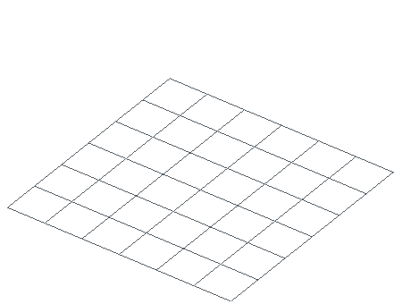
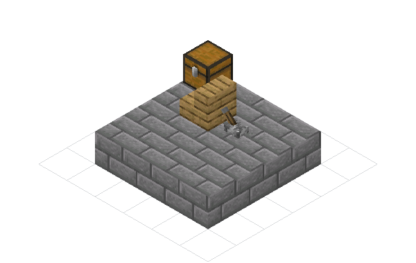

# Formats and I/O

Nucleation loads every supported container into one editable schematic model.
Input detection reads the payload, not the filename. Output is explicit: choose
an exporter, version, and settings, or let a native file method select the
exporter from a known extension.

<div class="bb-kineglyph" data-kineglyph="formats-and-io" data-theme="nucleation" data-autoplay="false" data-controls="false" data-readout="false" aria-busy="true">
  
  
</div>

## One fixture in three bindings

The examples build the same 19-block fixture. It includes block-state
properties and chest NBT because those are common format-loss boundaries.

=== "Python"

    ```python
    --8<-- "examples/readme/formats-and-io/formats_io.py:build"
    ```

=== "JavaScript"

    ```javascript
    --8<-- "examples/readme/formats-and-io/formats_io.mjs:build"
    ```

=== "Rust"

    ```rust
    --8<-- "examples/readme/formats-and-io/rust/src/main.rs:build"
    ```

<figure markdown="span">
  { width="460" }
  <figcaption>The three programs export this fixture with exact schematic-content parity.</figcaption>
</figure>

## Supported containers

| Format | Extension | Read | Write | Exporter key | Important boundary |
| --- | --- | :---: | :---: | --- | --- |
| Litematica | `.litematic` | yes | yes | `litematic` | Preserves multiple regions and Java data |
| Sponge Schematic | `.schem` | yes | yes | `schematic` | Export versions `v2` and `v3` |
| Bedrock structure | `.mcstructure` | yes | yes | `mcstructure` | Translates Java IDs and states through GeyserMC mappings |
| Java structure SNBT | `.snbt` | yes | yes | `structure_snbt` | Textual, rectangular, and single-volume |
| Nucleation snapshot | `.nusn` | yes | yes | `snapshot` | Fast uncompressed internal interchange |
| Legacy MCEdit | `.schematic` | yes | no | none | Numeric pre-Flattening IDs; import only |

Use `.schem` for modern Sponge output. The writer accepts `.schematic` as an
extension alias, but it still produces Sponge data, not the legacy MCEdit
format.

World data has a separate surface because a world can be much larger than a
structure container:

- MCA region bytes: `from_mca` and `from_mca_bounded`;
- zipped world bytes: `from_world_zip`, bounded variants, or `from_data`;
- native world directory: `from_world_directory` and its bounded variant;
- output: `save_world`, `to_world_zip_b64`, or the `world` exporter.

Use [Streaming and worlds](streaming-and-worlds.md) when the complete world
should not become one in-memory schematic.

## Detect input by content

`load_from_file` reads the bytes and runs the registered detectors. Renaming a
litematic to `unknown.bin` does not change its format. `from_data` performs the
same detection on a byte buffer and works in every generated binding.

=== "Python"

    ```python
    --8<-- "examples/readme/formats-and-io/formats_io.py:bytes"
    ```

=== "JavaScript"

    ```javascript
    --8<-- "examples/readme/formats-and-io/formats_io.mjs:bytes"
    ```

=== "Rust"

    ```rust
    --8<-- "examples/readme/formats-and-io/rust/src/main.rs:bytes"
    ```

If a detector recognizes the container but parsing fails, loading returns a
parse error. If no detector matches, it returns an invalid-argument error. It
does not manufacture a partial schematic from unknown bytes.

Use bounded decoders for untrusted or unusually large payloads. The limits cap
input bytes, decompressed NBT bytes, region count, volume, palette size, block
entities, and entities before the payload can consume unbounded memory:

=== "Python"

    ```python
    build = Schematic.from_data_bounded(payload, "")  # conservative defaults
    ```

=== "JavaScript"

    ```javascript
    const build = Schematic.fromDataBounded([...payload], ""); // conservative defaults
    ```

=== "Rust"

    ```rust
    use nucleation::formats::limits::DecodeLimits;

    let limits = DecodeLimits::default();
    let build = manager.read_bounded(&payload, &limits)?;
    ```

An empty JSON string selects `DecodeLimits::default()`. To override limits in
a generated binding, serialize the complete limits object with every field;
missing fields are rejected instead of silently inheriting values.

## Write bytes or files

Generated bindings serialize shared binary output as base64. Decode it before
writing a file or sending an HTTP response. This is the normal JavaScript/WASM
path because browser code has no native filesystem method.

The general form is:

```text
save_as_b64(exporter_key, version, settings_json)
```

Pass an empty version or settings string to use that exporter's defaults.
Convenience methods such as `to_litematic_b64`, `to_schematic_b64`,
`to_mcstructure_b64`, `to_snapshot_b64`, and `to_world_zip_b64` fix the target
format in the method name.

Python and Rust native builds can also write files directly. The filename
selects the format:

```python
build = Schematic.load_from_file("input.litematic")
build.set_block(1, 3, 1, "minecraft:glowstone")
build.save_to_file("output.schem")
```

An unknown extension is an error. To write through an opaque filename or pin a
Sponge version, name the exporter:

```python
build.save_to_file_with_format("artifact.bin", "schematic", "v2")
```

Supported exporter keys are `litematic`, `schematic`, `mcstructure`,
`structure_snbt`, `snapshot`, and `world`. An unsupported key or version fails
before a fallback format can be written.

## What a round trip preserves

The verifier runs every binding, loads every exported file through content
detection, and compares the results to the Litematica fixture with the exact
diff preset.

| Download | Bytes in this artifact | Exact diff distance | Interpretation |
| --- | ---: | ---: | --- |
| [Litematica](../downloads/readme/formats-and-io/round-trip.litematic) | 489 | 0 | Full fixture content preserved |
| [Sponge v3](../downloads/readme/formats-and-io/round-trip.schem) | 336 | 1 | Blocks, states, and chest data preserved; reader adds an empty `components` compound |
| [Structure SNBT](../downloads/readme/formats-and-io/round-trip.snbt) | 39,429 | 0 | Full fixture content preserved |
| [Snapshot](../downloads/readme/formats-and-io/round-trip.nusn) | 8,984 | 0 | Full fixture content preserved |
| [Bedrock structure](../downloads/readme/formats-and-io/round-trip.mcstructure) | 945 | 3 | Edition translation changes the Java-facing representation |

<figure markdown="span">
  { width="600" }
  <figcaption>Visual equality is useful, but the verifier compares blocks, properties, block entities, entities, and metadata.</figcaption>
</figure>

The Litematica byte count can vary slightly because its metadata carries a
timestamp. Exact content equality does not mean byte-for-byte container
identity. Compression settings, tag order, format metadata, and rectangular air
cells can all change serialized bytes without changing the represented build.

Sponge's empty `components` compound is harmless but visible to an exact NBT
comparison. Bedrock output is a translation boundary, not a same-edition round
trip. Read [Versions and translation](versions-and-translation.md) before using
cross-edition output as an equality check.

Structure SNBT writes a complete rectangular structure, including air. It also
rejects axes longer than 256 blocks or volumes larger than 262,144 cells before
allocating the full rectangle. Its corpus tests cover 33 Java GameTest
structures, including block entities and entities.

Legacy MCEdit remains import-only because numeric IDs cannot represent modern
block states without loss.

## Verify the guide

The guide verifier executes Python, JavaScript, and Rust; checks exact parity
between their source schematics; reloads all five formats from each binding;
and regenerates the still, downloads, and 53-frame animation.

```bash
./tools/verify-formats-io-docs.sh
```

Continue with [Basics](basics.md) for editing,
[Versions and translation](versions-and-translation.md) for data-version and
edition boundaries, or [Pluggable storage](storage.md) for filesystem, SSH, S3,
Redis, and Postgres URIs.
