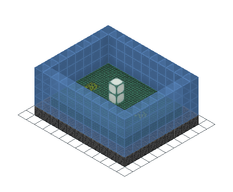
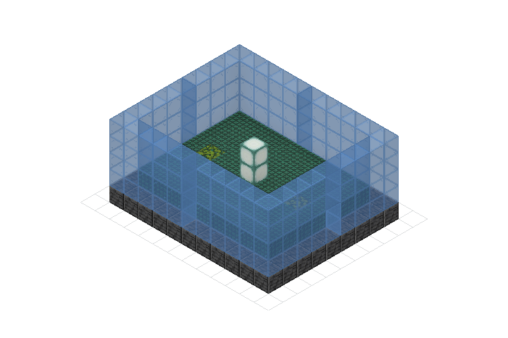

# Meshing and rendering

Meshing turns schematic cells plus a resource pack into textured triangles.
Rendering turns those triangles plus a camera and lights into pixels. Keep the
two stages separate when the result belongs in a browser, a DCC tool, a cache,
or a custom engine.

<div class="bb-kineglyph" data-kineglyph="meshing-and-rendering" data-theme="nucleation" data-autoplay="false" data-controls="false" data-readout="false" aria-busy="true">
  
  
</div>

## A layer-complete fixture in three bindings

The render lab contains 308 blocks in an 11 by 5 by 9 volume. Deepslate and
prismarine exercise the opaque layer, azalea leaves exercise cutout geometry,
and stained glass exercises transparency. All three programs produce 2,320
vertices and 1,160 triangles with the guide's resource pack.

=== "Python"

    ```python
    --8<-- "examples/readme/meshing-and-rendering/mesh_render.py:build"
    ```

=== "JavaScript"

    ```javascript
    --8<-- "examples/readme/meshing-and-rendering/mesh_render.mjs:build"
    ```

=== "Rust"

    ```rust
    --8<-- "examples/readme/meshing-and-rendering/rust/src/main.rs:build"
    ```

<figure markdown="span">
  { width="460" }
  <figcaption>The 48 frames use sphere-fit framing, so the camera distance stays fixed throughout the orbit.</figcaption>
</figure>

[Download the fixture](../downloads/readme/meshing-and-rendering/render-lab.schem)
or its [generated GLB](../downloads/readme/meshing-and-rendering/render-lab.glb).

## Mesh to portable data

A resource pack supplies blockstate selection, parented block models, textures,
animation metadata, and tint inputs. The mesher resolves each schematic state
through that pack, culls hidden geometry, builds a texture atlas, and emits
three render layers.

=== "Python"

    ```python
    --8<-- "examples/readme/meshing-and-rendering/mesh_render.py:mesh"
    ```

=== "JavaScript"

    ```javascript
    --8<-- "examples/readme/meshing-and-rendering/mesh_render.mjs:mesh"
    ```

=== "Rust"

    ```rust
    --8<-- "examples/readme/meshing-and-rendering/rust/src/main.rs:mesh"
    ```

`MeshResult` exposes vertex and triangle counts, transparency, bounds, and
three serialization paths:

| Output | Use |
| --- | --- |
| GLB | Standard binary glTF for browsers, engines, and DCC tools |
| USDZ | Apple spatial/AR workflows |
| NUCM | Nucleation's compact cached-mesh format for fast reloads |

Generated bindings return those binaries as base64. Rust returns byte vectors
from `to_glb` and `to_usdz`. A valid GLB begins with `glTF`; checking the magic
before publishing catches a surprising number of transport mistakes.

The three guide GLBs have matching geometry counts but are not required to be
byte-identical. Map iteration and container metadata can change byte order
without changing the represented mesh.

## Why the mesh has three layers

The mesh separates GPU state that cannot be drawn correctly in one pass:

1. Opaque faces draw first, write depth, and do not blend.
2. Cutout faces write depth but discard texels below the alpha threshold.
3. Transparent faces blend after solid geometry and do not write depth.

Leaves belong in cutout, not transparent: their holes should reveal geometry
behind them without blending the leaf surface. Stained glass belongs in the
transparent layer. Drawing it before opaque blocks would make the result depend
on submission order rather than visibility.

`RawMeshExport` exposes positions, normals, UVs, vertex colors, indices, and
RGBA atlas pixels for a custom renderer. The arrays are little-endian binary
streams in generated bindings. Vertex colors already carry ambient occlusion,
biome tint, and block color multipliers.

## Control mesh cost and appearance

`MeshConfig.create()` uses these defaults:

| Setting | Default | Effect |
| --- | ---: | --- |
| Cull hidden faces | true | Removes faces between adjacent opaque blocks |
| Cull occluded blocks | true | Skips blocks hidden on all six sides |
| Ambient occlusion | true | Darkens corners and contacts |
| AO intensity | 0.4 | Sets the darkening strength |
| Biome | none | Leaves and grass use the pack's untinted fallback |
| Atlas maximum | 4096 px | Caps either atlas dimension |
| Greedy meshing | false | Keeps ordinary model quads instead of merging compatible planes |

The fixture sets `lush_caves` so its azalea leaf tint is deterministic. Pick a
biome whenever color matching matters. Enable greedy meshing for large regular
surfaces after checking that the target blocks and texture tiling still look as
intended.

`ResourcePackList` merges packs from lowest to highest priority. Later ZIPs
replace earlier blockstates, models, or textures on the same key, matching
Minecraft pack ordering. Parse a pack once and reuse its `ResourcePack` handle
across many meshes or renders.

## Choose one mesh, regions, or chunks

| Work unit | API | Use when |
| --- | --- | --- |
| Whole schematic | `MeshResult.create` / `to_mesh` | The complete mesh fits comfortably in memory |
| Named regions | `MultiMeshResult.create` / `mesh_by_region` | Litematic regions need separate transforms or toggles |
| Eager chunks | `ChunkMeshResult.create_with_size` / `mesh_by_chunk_size` | A viewer needs spatial tiles |
| Shared-atlas chunks | build a global atlas, then `create_with_atlas` | Many chunks should not duplicate atlas pixels |
| Background job | `MeshJob.start`, poll, then `take_result` | A host UI must stay responsive during chunk meshing |
| Native iterator | `mesh_chunks` or `mesh_chunks_parallel` | Rust code wants streaming or scoped parallelism |

A global atlas scans the schematic's unique palette states, not every cell.
Chunks then reference one texture set. NUCM v2 can store that shared atlas once
for the complete cache.

`MeshJob.poll_progress()` reports atlas construction, chunk progress, complete,
or failed. `take_result()` consumes the job and may block if called early; a
second call returns `AlreadyConsumed`.

## Render pixels on native targets

The native renderer accepts the same schematic and resource pack. Its config
controls output size, perspective or orthographic projection, yaw, pitch, zoom,
field of view, ambient and directional lights, background alpha, and the world
grid.

=== "Python"

    ```python
    --8<-- "examples/readme/meshing-and-rendering/mesh_render.py:render"
    ```

=== "Rust"

    ```rust
    --8<-- "examples/readme/meshing-and-rendering/rust/src/main.rs:render"
    ```

JavaScript/WASM ships the mesher, not the wgpu renderer. Generate GLB in the
worker or server and draw it with Three.js, Babylon.js, or another WebGL/WebGPU
consumer.

<figure markdown="span">
  { width="720" }
  <figcaption>The renderer consumes the same resource-pack models, atlas, layer ordering, and ambient-occlusion data as the GLB path.</figcaption>
</figure>

### Fit the camera deliberately

`set_isometric()` selects orthographic projection at yaw 45 degrees and pitch
about 35.264 degrees. `set_sphere_fit(true)` fits a bounding sphere instead of
the current silhouette. The sphere does not change during an orbit, so a
turntable does not pulse closer and farther as wide and narrow sides rotate
past the camera.

The ordinary fit is tighter for one still. Sphere fit is safer for animation.
`set_zoom` adjusts either result after fitting.

A transparent PNG needs an RGBA background with alpha below 1. The fixture uses
`set_background(0, 0, 0, 0)`. Grid lines sit on half-integer cell boundaries;
placing the horizontal grid just below `y = -0.5` keeps it under blocks centered
at integer Y.

## Verify the guide

The verifier executes all three mesh sources against the same pack, checks
exact schematic parity, asserts the shared 2,320-vertex/1,160-triangle result,
validates every GLB header, renders native Python and Rust PNGs, and regenerates
the downloadable GLB, still, and 48-frame turntable.

```bash
./tools/verify-meshing-rendering-docs.sh
```

Continue with [Animation](animation.md) for construction groups, effects,
camera tracks, GIF, and video output.
