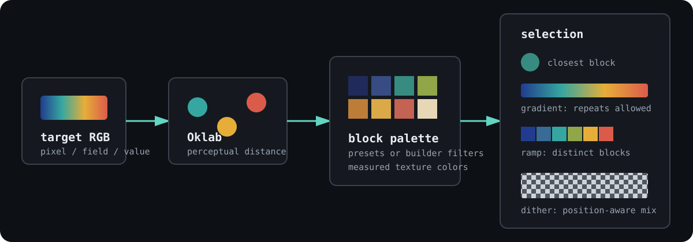
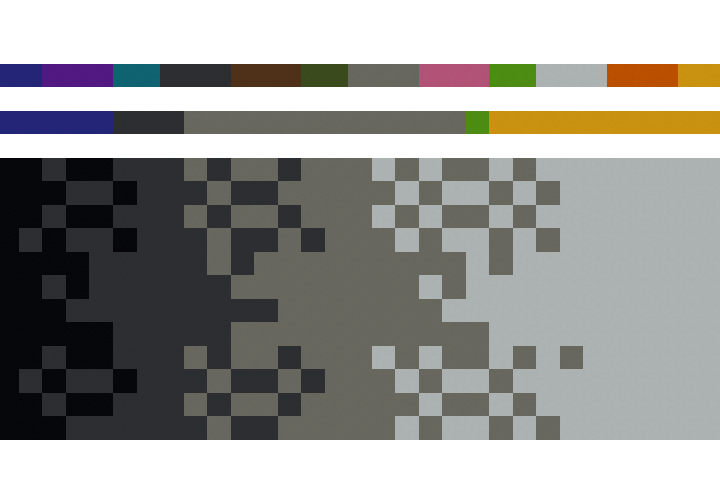

# Palettes and color

Minecraft blocks are not flat swatches. Nucleation measures their texture
colors, converts those measurements to Oklab, and uses perceptual distance to
choose blocks. A palette limits the candidates before matching begins. That
separation matters: color matching answers *which candidate is nearest*;
palette design decides *which candidates are acceptable*.



## One color atlas in three bindings

The guide fixture is a 32 by 16 wall with 448 blocks. Its large lower panel
maps 32 gray values through four concrete blocks with ordered dithering. The
middle strip is a 32-sample concrete gradient, where repeated block IDs are
allowed. The top strip is a 12-block ramp, where every selected ID must be
distinct.

First choose the allowed blocks. The builder example keeps survival-obtainable,
opaque, full blocks near a measured green. The fixture also uses a preset and
an explicit four-block palette.

=== "Python"

    ```python
    --8<-- "examples/readme/palettes-and-color/palettes_color.py:choose"
    ```

=== "JavaScript"

    ```javascript
    --8<-- "examples/readme/palettes-and-color/palettes_color.mjs:choose"
    ```

=== "Rust"

    ```rust
    --8<-- "examples/readme/palettes-and-color/rust/src/main.rs:choose"
    ```

Then use the palette as a lookup table. All three programs below produce the
same schematic, including every dither decision.

=== "Python"

    ```python
    --8<-- "examples/readme/palettes-and-color/palettes_color.py:build"
    ```

=== "JavaScript"

    ```javascript
    --8<-- "examples/readme/palettes-and-color/palettes_color.mjs:build"
    ```

=== "Rust"

    ```rust
    --8<-- "examples/readme/palettes-and-color/rust/src/main.rs:build"
    ```

<figure markdown="span">
  { width="500" }
  <figcaption>Four grayscale blocks produce the lower panel. Position-aware Bayer thresholds create the intermediate tones.</figcaption>
</figure>

[Download the color atlas](../downloads/readme/palettes-and-color/color-atlas.schem).

## Pick a palette before picking a color

Presets cover common material constraints:

| Palette | Contents |
| --- | --- |
| `concrete`, `wool`, `terracotta` | The corresponding 16-color material family; terracotta also includes plain terracotta |
| `wood` | Planks plus bamboo mosaic |
| `grayscale` | Opaque full cubes close to the neutral Oklab axis |
| `structural` | A conservative set for load-bearing-looking construction |
| `decorative` | A broader set that permits stairs and slabs but excludes block entities |
| `solid` | No transparent, falling, or block-entity candidates |
| `all` | Every colored, placeable block in blockpedia |

`from_block_ids` is the strictest design choice because you name every allowed
material. Unknown IDs and blocks without measured color are skipped rather
than causing an error, so check `len()` after construction.

`PaletteBuilder` combines block metadata and color constraints. Repeated
required tags use AND semantics. Repeated definition kinds use OR semantics.
Geometry and transparency filters use extracted model metadata, not guesses
based on block names. The generated-binding builder is consumed by `build()`;
calling it again reports `AlreadyConsumed`. Native Rust uses the ordinary
owned-builder pattern.

Useful filters include:

- physical constraints: full blocks, no gravity, no support requirement;
- inventory constraints: survival-obtainable, no block entities, no light sources;
- registry constraints: required or excluded vanilla tags, definition kinds, and ID keywords;
- measured color constraints: Oklab lightness range, maximum chroma, or distance from an RGB target.

## Ramp and gradient solve different problems

Both APIs interpolate between endpoint colors in Oklab, but they impose
different constraints.

| Query | Guarantee | Best use |
| --- | --- | --- |
| `ramp_ids` | Exactly *n* distinct IDs in monotonic order | A material chart where each step must be different |
| `gradient_ids` | Exactly *n* samples; IDs may repeat | Indexing height, heat, density, escape time, or another scalar |
| `gradient_ids_between_blocks` | Same as gradient, using measured block colors as endpoints | A lookup anchored to two known materials |
| `sorted_by_lightness` | Every palette member ordered dark to light | Direct intensity indexing without endpoint colors |

A concrete palette has only 16 candidates. Asking it for 32 gradient samples
must repeat IDs, and that is useful: adjacent values remain stable instead of
being forced onto a worse color. A 12-step ramp solves a different optimization
problem. It assigns 12 distinct blocks to ordered targets along the color line,
so some picks may be farther from their target than the nearest repeated block.

`ramp_ids` rejects zero steps, equal endpoints, and palettes smaller than the
requested ramp. `gradient_ids` returns the requested number of entries unless
the palette is empty. Texture averages drive both operations. Patterned blocks
can therefore match an average color while reading as noisy at full scale;
exclude them by tag, kind, or keyword when surface character matters.

## Ordered dithering adds spatial resolution

`closest_block_dithered` finds the two nearest palette colors, projects the
target between them, and compares that fraction with a 4 by 4 Bayer threshold.
The threshold depends on `(x, y, z)`, so the result is deterministic and
neighboring cells distribute the two materials in a stable pattern.

This is not random noise. The same target and position always return the same
block. Pass real schematic coordinates rather than image-local coordinates if
separate tiles must join without a visible seam. With fewer than two palette
members, dithering reduces to ordinary nearest-color matching.

`dithered()` applies the same position-aware behavior when a color, linear
gradient, curve-gradient, bilinear-gradient, or shaded brush snaps its output
through a palette. Direct ramp and list queries are unchanged.

<figure markdown="span">
  { width="720" }
  <figcaption>The large panel has only four source materials. Its apparent extra shades come from spatial mixing, not new block colors.</figcaption>
</figure>

## From images to fields

The same pipeline covers several jobs:

- pixel art: map each source pixel through a constrained, dithered palette;
- heightmaps: use brightness for height and the source RGB for surface material;
- scalar fields: index a repeated gradient by density, temperature, or distance;
- shaded shapes: let a brush compute lighting, then snap the result to a material family;
- material zoning: construct separate palettes for structural, decorative, or biome-specific surfaces.

For large images, precompute a gradient when the input is one-dimensional.
Call `closest_block` or `closest_block_dithered` when the full RGB vector
matters. Palette construction scans block metadata, so build once and reuse the
result through the complete image or volume.

## Verify the guide

The verifier executes the Python, JavaScript, and Rust sources, compares their
schematics with an exact diff, checks the 448-block count and 32 by 16 by 1
bounds, regenerates the still and animation, and validates both image sizes.

```bash
./tools/verify-palettes-color-docs.sh
```

Continue with [SDFs and fields](sdf-and-fields.md) to drive block choice from
signed distance, gradients, noise, and material rules.
