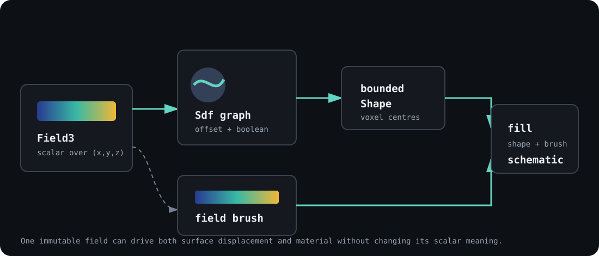
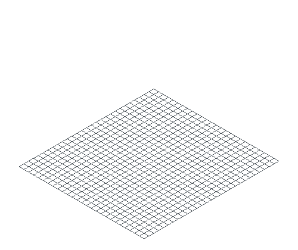
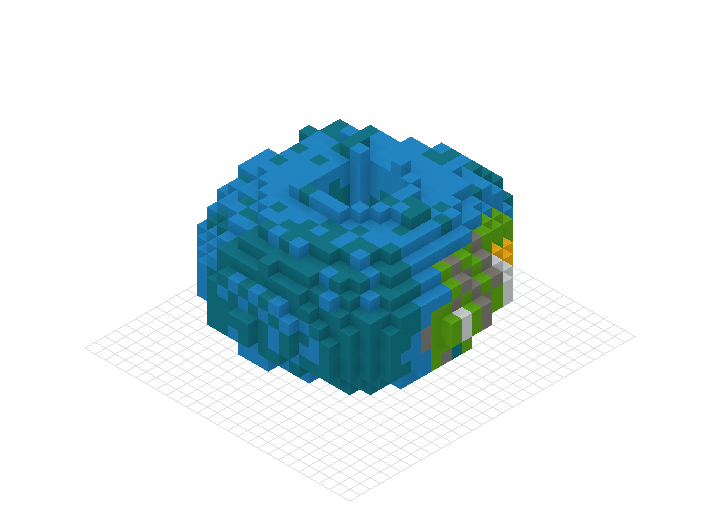

# SDFs, terrain, and fields

A signed distance field answers one geometric question at every point: how far
is this point from a surface? Negative values are inside, zero lies on the
surface, and positive values are outside. A scalar `Field3` makes no inside or
outside claim. It simply returns a value over `(x, y, z)` that can drive noise,
material, displacement, or another continuous property.

Keeping those meanings separate makes the graph reusable. One scalar field can
perturb an SDF and color the resulting blocks without pretending that the noise
itself is a distance.



## One field, two jobs, three bindings

The field observatory uses the same seeded FBM node twice. It offsets an
ellipsoid's surface by up to 1.7 blocks, then colors every occupied voxel through
a dithered concrete palette. A capped cylinder cuts the central shaft. A torus
is smooth-unioned around the equator.

The graph is immutable. Each operation returns a new node, so the named pieces
remain available for evaluation, bounds inspection, serialization, or a
different composition.

=== "Python"

    ```python
    --8<-- "examples/readme/sdf-and-fields/sdf_fields.py:graph"
    ```

=== "JavaScript"

    ```javascript
    --8<-- "examples/readme/sdf-and-fields/sdf_fields.mjs:graph"
    ```

=== "Rust"

    ```rust
    --8<-- "examples/readme/sdf-and-fields/rust/src/main.rs:graph"
    ```

`to_shape` supplies the bridge to ordinary building tools. The shape chooses
occupied cells; the field brush chooses their block states.

=== "Python"

    ```python
    --8<-- "examples/readme/sdf-and-fields/sdf_fields.py:build"
    ```

=== "JavaScript"

    ```javascript
    --8<-- "examples/readme/sdf-and-fields/sdf_fields.mjs:build"
    ```

=== "Rust"

    ```rust
    --8<-- "examples/readme/sdf-and-fields/rust/src/main.rs:build"
    ```

All three programs produce exactly 3,175 blocks in a 22 by 14 by 24 volume.
The generated-binding methods clone the immutable field into both consumers,
so the original wrapper does not need to outlive the SDF or brush.

<figure markdown="span">
  { width="500" }
  <figcaption>The animation records the verified schematic by Y layer. It does not use a separate approximation of the SDF.</figcaption>
</figure>

[Download the field observatory](../downloads/readme/sdf-and-fields/field-observatory.schem).

## Build geometry as an expression graph

SDF nodes fall into four useful groups:

| Group | Examples | What changes |
| --- | --- | --- |
| Primitives | sphere, box, ellipsoid, torus, capsule, cone, cylinder, prism, pyramid | Introduces a surface with known distance behavior |
| Set operations | union, intersection, subtraction, XOR | Combines inside and outside regions |
| Smooth operations | smooth union, subtraction, intersection | Blends a seam over a chosen radius |
| Domain operations | translate, rotate, scale, mirror, elongate, twist, bend, repeat, warp | Changes where a child field is evaluated |

Name intermediate nodes when the structure has meaning. `hull.subtract(window)`
is easier to inspect than one long chain, and the named `window` can be moved or
reused without reconstructing the hull.

An SDF remains continuous until sampling. `eval_at(x, y, z)` returns the field
value directly. `normal(x, y, z, epsilon)` returns a normalized surface
gradient, using analytic or automatic derivatives where available and central
differences as a fallback. Normals can drive shaded brushes, slope masks, snow
placement, or erosion rules.

## Convert a field to voxels deliberately

`to_shape()` infers finite bounds from the graph, then `BuildingTool.fill`
tests voxel centres. A cell at integer `(x, y, z)` is occupied when the SDF at
`(x + 0.5, y + 0.5, z + 0.5)` is at or below zero.

Unbounded nodes such as planes, infinite cylinders, and infinite cones cannot
infer a finite work area. Use `to_shape_bounded(min..., max...)` and make the
sampling box explicit. Every bounded conversion validates the inclusive span
with widened arithmetic and rejects work above 16,777,216 voxel centres before
iteration or allocation. Split a larger terrain into tiles or chunks.

Bounds are conservative, not a promise that every cell is filled. Subtraction
may leave most of a bounding box empty. Use a tight explicit box when sampling a
small part of a large repeated or warped graph.

## Use `Field3` for scalar meaning

`Field3.value_noise_fbm(frequency, seed, octaves)` is deterministic and returns
values in the proven range `[-1, 1]`. The seed fixes the lattice. Frequency
controls world-space scale; octaves add progressively finer detail.

A scalar field can feed two primary consumers:

- `Sdf.offset_by_field(field, amplitude)` perturbs a surface while expanding
  its inferred bounds by the field's proven maximum offset;
- `Brush.field3(field, stops, colors, lo, hi, space)` maps scalar values to a
  color gradient, then snaps the result through its palette.

Ask `output_range()` before remapping a field. A consumer should not invent a
range when the graph cannot prove one. JSON round trips validate the same
arguments as typed construction, and field JSON larger than 1 MiB is rejected
before deserialization.

The observatory asserts field range, geometry, the empty central shaft, and SDF
JSON parity in every binding:

=== "Python"

    ```python
    --8<-- "examples/readme/sdf-and-fields/sdf_fields.py:inspect"
    ```

=== "JavaScript"

    ```javascript
    --8<-- "examples/readme/sdf-and-fields/sdf_fields.mjs:inspect"
    ```

=== "Rust"

    ```rust
    --8<-- "examples/readme/sdf-and-fields/rust/src/main.rs:inspect"
    ```

## Choose geometry and material independently

The SDF-to-shape bridge works with every brush. A solid brush gives one block
to the complete volume. A shaded brush reads SDF normals. Linear, curve, and
point gradients color by position. A field brush colors from any scalar field,
including the same node used for displacement.

The reverse separation is also useful: evaluate a field over an ordinary
cuboid, sphere, imported mesh voxelization, or existing schematic. Material
logic does not require SDF geometry. This is how the same noise can paint a
terrain, a conventional building, and a generated shell without duplicating
its evaluator.

<figure markdown="span">
  { width="720" }
  <figcaption>The field changes both silhouette and material, but the SDF remains responsible for occupancy.</figcaption>
</figure>

## Persist graphs and write portable formulas

`Sdf.to_json()` and `Sdf.from_json_string()` persist typed expression graphs.
Use live objects while composing; serialize at storage, network, or process
boundaries. Import applies byte, node-count, nesting, numeric, and structural
validation before a graph can be sampled.

`FieldProgramBuilder` covers formulas that are not built-in nodes. It emits
versioned typed bytecode with scalar, vector, and boolean values; local slots;
arithmetic, trigonometry, comparison, selection; and statically bounded repeat
blocks. `Sdf.from_program(program)` wraps the result as an ordinary graph node.

Classify a custom program honestly:

| Distance kind | Meaning |
| --- | --- |
| Exact | The output is a true signed distance |
| Lower bound | Conservative for distance-guided traversal |
| Estimate | Useful near the surface, without a strict distance guarantee |
| Implicit | Only sign and the zero surface are meaningful |

The validator rejects unbounded loops, type-invalid stacks, non-finite
constants, invalid bounds, oversized programs, and unknown serialization
versions. Host-language callbacks are useful for local experiments, but they
are not portable or serializable and cross the language boundary for every
sample. Prefer built-in nodes or a field program for published generators.

## Verify the guide

The verifier runs the Python, JavaScript, and Rust sources, exact-diffs all
three schematics, checks the 3,175-block count and dimensions, exercises SDF and
field JSON round trips, regenerates the still and turntable build, and validates
both image sizes.

```bash
./tools/verify-sdf-fields-docs.sh
```

Continue with [Palettes and color](palettes-and-color.md) when the geometry is
settled and the remaining problem is material selection.
