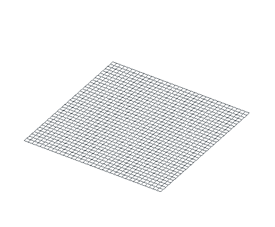
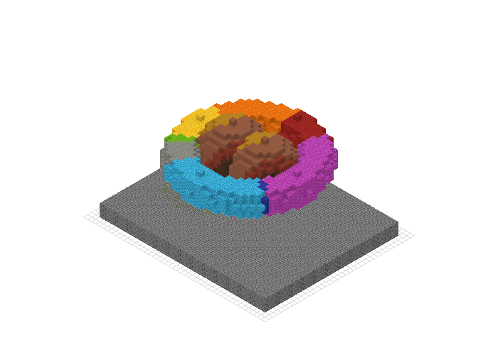

# Shapes and brushes

A `Shape` answers whether a coordinate belongs to a volume. A `Brush` chooses
the block written at an accepted coordinate. `BuildingTool.fill` combines the
two without constructing a coordinate list in the host language.

This separation lets one torus use a solid block, a spatial gradient, surface
shading, or a gradient that follows the ring. The animation below uses the
torus parameter to divide the shape into 24 ordered groups. Its color gradient
reads the same parameter, so construction order and material position agree.

<figure markdown="span">
  { width="460" }
  <figcaption>The shape supplies coordinates and a normalized position around the ring; the brush maps that position to wool.</figcaption>
</figure>

## Geometry and material are separate

<div class="bb-kineglyph" data-kineglyph="shapes-and-brushes" data-theme="nucleation" data-autoplay="false" data-controls="false" data-readout="false" aria-busy="true">
  
</div>

The shape owns spatial questions: bounds, membership, surface normal, and, for
parametric shapes, a normalized `t`. The brush owns material questions. Color
brushes can snap their result to a selected block palette.

```text
Shape.for_each_point
        │
        ├── coordinate
        ├── surface normal
        └── optional parameter t
                    │
                    ▼
             Brush.get_block
                    │
                    ▼
          schematic palette write
```

## One scene in three bindings

The fixture uses four independent operations:

1. Fill a stone-brick cuboid with a solid brush.
2. Replace only the part of that plinth inside a sphere.
3. Fill a torus with a closed curve gradient.
4. Union two spheres, hollow the result, and shade it by surface normal.

=== "Python"

    ```python
    --8<-- "examples/readme/shapes-brushes/shapes_brushes.py:build"
    ```

=== "JavaScript"

    ```javascript
    --8<-- "examples/readme/shapes-brushes/shapes_brushes.mjs:build"
    ```

=== "Rust"

    ```rust
    --8<-- "examples/readme/shapes-brushes/rust/src/main.rs:build"
    ```

<figure markdown="span">
  { width="700" }
  <figcaption>All three programs produce this 6,627-block schematic with exact cell parity.</figcaption>
</figure>

[Download the generated orbital garden](../downloads/readme/shapes-brushes/orbital-garden.schem)

Generated bindings expose opaque `Shape` and `Brush` values. Rust exposes the
concrete geometry types and the `ShapeEnum`/`BrushEnum` dispatch used by the
same fill engine.

## Compose shapes before filling

Boolean combinators return another shape. They can be nested and then passed to
any brush:

| Combinator | Accepted coordinates |
| --- | --- |
| `union_with` | inside either child |
| `intersection_with` | inside both children |
| `difference_with` | inside the first child and outside the second |
| `hollow(thickness)` | inside the shape and within the requested face distance of its boundary |

The shell in the fixture is evaluated as:

```text
hollow(
  union(
    sphere(center = [-4, 14, 0], radius = 6),
    sphere(center = [ 4, 14, 0], radius = 6)
  ),
  thickness = 1
)
```

Composition operates on voxel membership. A smooth blend between distance
fields belongs to the [SDFs and fields](sdf-and-fields.md) guide.

### Primitive shapes

| Family | Constructors |
| --- | --- |
| Volumes | `sphere`, `cuboid`, `ellipsoid`, `cylinder`, `cylinder_between`, `cone`, `pyramid`, `polygon_prism` |
| Curved paths | `torus`, `line`, `bezier`, `tube_along` |
| Surfaces | `disk`, `plane`, `triangle` |
| Derived | `sdf`, `sdf_bounded`, voxelized mesh shapes, boolean combinators, `hollow` |

Constructors use schematic coordinates. Axes and direction vectors are
normalized internally where required. Zero-length vectors fall back to each
shape's documented default orientation.

## Choose how the shape is painted

| Brush | Material rule |
| --- | --- |
| `solid(block)` | one fixed block state |
| `color(r, g, b)` | palette block nearest one target color |
| `linear_gradient` | interpolation between two anchored points |
| `bilinear_gradient` | four corner colors over a patch |
| `point_gradient` | distance-weighted colors around anchor points |
| `curve_gradient` | color stops sampled from a shape's parameter `t` |
| `shaded` | base color lit by the shape's surface normal |
| `spotlight` | color constrained by a position, direction, and cone |
| `field` / `field3` / `field_sdf` | color selected from a scalar field |

Color interpolation can use RGB or Oklab. The interpolated color is then
matched against the brush palette. A wool palette cannot select concrete, even
when concrete is the closer global color match.

`curve_gradient` needs a parametric shape such as a torus, line, cylinder,
cone, pyramid, bezier, or tube path. Closed curves should repeat their first
color at stop `1.0`; that is why the fixture begins and ends with red.

See [Palettes and color](palettes-and-color.md) for preset contents, custom
filters, ramps, and ordered dithering.

## Limit an edit with a mask

The ordinary `fill` operation replaces every accepted cell. Two masked forms
inspect the destination first:

- `fill_only_air` writes only where the schematic currently contains air or no
  block.
- `fill_replacing` writes only where the existing block ID appears in its JSON
  target list. State properties do not affect the match.

The garden's weathering sphere overlaps the plinth and surrounding air. Its
target list contains only `minecraft:stone_bricks`, so moss is written into the
plinth without creating a mossy sphere above it.

Fill order is observable when shapes overlap. In the fixture the gradient torus
is written before the terracotta shell, so shell cells win at intersections.

## Cost and bounds

A fill first expands the schematic to the shape bounds, then enumerates
candidate coordinates inside those bounds. Primitive shapes provide specialized
iteration where available. Composite shapes scan their combined bounds and
test child membership.

The bounding box still matters when the shape is mostly empty. A long diagonal
line and a thin torus can occupy relatively few blocks while asking the shape
to examine a larger coordinate range. For a supplied sparse point cloud,
[`set_blocks`](fast-generation.md) is a better representation.

`BuildingTool.fill` keeps the enumeration inside the native or WASM module. It
does not create a Python or JavaScript list containing every accepted voxel.
The resulting schematic region still follows the allocation rules described in
[Fast schematic generation](fast-generation.md#bounds-are-part-of-the-memory-model).

## Inspect and verify the artifact

Each executable example checks the exact block count, tight dimensions, and a
known plinth cell before saving:

=== "Python"

    ```python
    --8<-- "examples/readme/shapes-brushes/shapes_brushes.py:inspect"
    ```

=== "JavaScript"

    ```javascript
    --8<-- "examples/readme/shapes-brushes/shapes_brushes.mjs:inspect"
    ```

=== "Rust"

    ```rust
    --8<-- "examples/readme/shapes-brushes/rust/src/main.rs:inspect"
    ```

The guide verifier executes all three sources, loads their exports, and checks
an exact diff distance of zero. It also regenerates the still and the 56-frame
torus animation.

```bash
.venv/bin/python examples/readme/shapes-brushes/generate.py
./tools/verify-shapes-brushes-docs.sh
```
