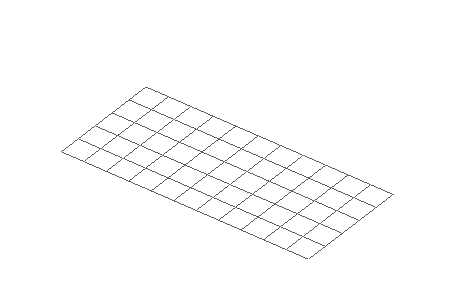
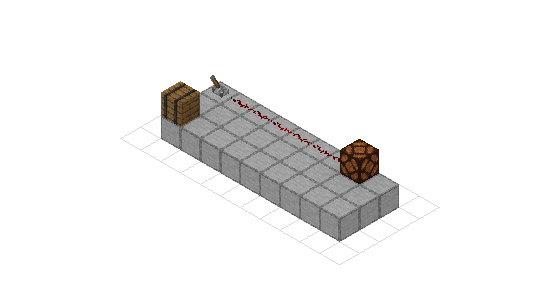
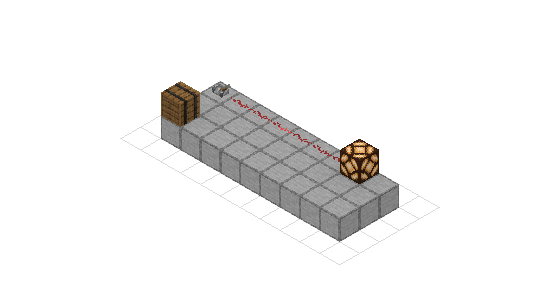

# Smart placement and simulation

Nucleation has four related tools for four different jobs. Descriptor
shorthands author block-entity data. Simulated placement derives the state a
new block should store. MCHPRS evaluates redstone logic. `TickSimulation`
advances a world in tick order.

They are not interchangeable. In particular, `{signal=13}` does not run a
simulator, and `{simulate=true}` does not leave a live world ticking behind the
schematic.

<div class="bb-kineglyph" data-kineglyph="smart-simulation" data-theme="nucleation" data-autoplay="false" data-controls="false" data-readout="false" aria-busy="true">
  
  
</div>

## One circuit, authored in three bindings

This fixture has a lever, six dust cells, a lamp, and a barrel whose contents
produce comparator strength 13. The six wires are placed in order through one
simulation setup, so their connection states are stored in the schematic.

<figure markdown="span">
  { width="460" }
  <figcaption>The animation is generated from the same 36-block fixture exercised by the examples.</figcaption>
</figure>

=== "Python"

    ```python
    --8<-- "examples/readme/smart-simulation/smart_simulation.py:author"
    ```

=== "JavaScript"

    ```javascript
    --8<-- "examples/readme/smart-simulation/smart_simulation.mjs:author"
    ```

=== "Rust"

    ```rust
    --8<-- "examples/readme/smart-simulation/rust/src/main.rs:author"
    ```

Python and JavaScript expose `set_blocks_simulated` as a batch convenience.
The native Rust API currently uses the descriptor path for each placement.
Both paths preserve placement order. The batch form avoids rebuilding the
same local simulation for each coordinate.

[Download the generated circuit](../downloads/readme/smart-simulation/smart-circuit.schem)

## Author comparator strength with `signal=`

Comparators read block-entity data, not a `signal` block-state property. This
descriptor creates the inventory needed for strength 13:

```text
minecraft:barrel[facing=west]{signal=13,item=iron_ingot}
```

The shorthand writes ordinary barrel NBT. Saving the schematic preserves the
inventory, and another reader does not need Nucleation to interpret it.
`item=` selects the stack item; it defaults to stone when omitted.

`signal=` accepts strengths from 0 through 15 on supported containers and
jukeboxes. It is an authoring rule, not a clock. No neighbours update and no
redstone event runs. Use a simulator when the value must propagate through a
circuit.

Inspect generated NBT before depending on it:

=== "Python"

    ```python
    data = json.loads(scene.get_block_entity_json(0, 1, 2))
    items = data["nbt"]["Items"]["List"]
    assert items[0]["Compound"]["id"]["String"] == "minecraft:iron_ingot"
    ```

=== "JavaScript"

    ```javascript
    const data = JSON.parse(scene.getBlockEntityJson(0, 1, 2));
    const items = data.nbt.Items.List;
    if (items[0].Compound.id.String !== "minecraft:iron_ingot") throw new Error("wrong item");
    ```

=== "Rust"

    ```rust
    use nucleation::BlockPosition;

    let entity = scene
        .get_block_entity(BlockPosition::new(0, 1, 2))
        .expect("barrel NBT");
    assert_eq!(entity.id, "minecraft:barrel");
    ```

## Derive a block state with `{simulate=true}`

A plain write stores the descriptor supplied by the caller. A simulated write
places the block through the tick engine, settles the affected component, and
writes derived states back into the schematic. That includes neighbouring
changes caused by placement.

The middle dust cell in the fixture ends as:

```text
minecraft:redstone_wire[east=side,north=none,power=0,south=none,west=side]
```

The tag is useful for dust connections, powered repeaters, piston extension,
and other states that depend on nearby blocks. It is not a visual connectivity
guess. A powered piston can extend during placement because the real placement
hooks run.

By default, Nucleation selects the active component around the edit and loads
a four-block halo as context. Unrelated map volume does not become part of that
simulation. Use `{simulate=world}` only when the edit must observe the entire
schematic.

For many placements of the same block, prefer the sequential batch:

=== "Python"

    ```python
    positions = [coordinate for x in range(1, 100) for coordinate in (x, 1, 0)]
    placed = scene.set_blocks_simulated(positions, "minecraft:redstone_wire")
    ```

=== "JavaScript"

    ```javascript
    const positions = Array.from({ length: 99 }, (_, i) => [i + 1, 1, 0]).flat();
    const placed = scene.setBlocksSimulated(positions, "minecraft:redstone_wire");
    ```

=== "Rust"

    ```rust
    for x in 1..100 {
        scene.set_block_from_string(x, 1, 0, "minecraft:redstone_wire{simulate=true}")?;
    }
    ```

The Python and JavaScript batch constructs one engine, then settles after each
coordinate so later placements see earlier results. Its work is approximately
the selected component setup plus the updates dispatched by all placements.
Separate convenience calls repeat setup.

`{simulate=true}` and `signal=` must not share one brace group. One derives
world state; the other authors NBT. Split the operations or choose the one the
block actually needs.

## Evaluate a circuit with MCHPRS

MCHPRS compiles a redstone circuit for repeated logic evaluation. Use it for a
truth table, a typed executor, or many input probes where piston timing, fluids,
and entities are not part of the result.

The Python example flips the fixture's lever, advances two redstone ticks, and
reads both the lamp and the final dust strength:

```python
--8<-- "examples/readme/smart-simulation/smart_simulation.py:mchprs"
```

<div class="grid cards" markdown>

-   **Idle**

    

-   **After two redstone ticks**

    

</div>

`flush()` copies pending compiler changes into the MCHPRS world before a state
query. Call `sync_to_schematic()` when the powered result must become a saved or
rendered schematic.

MCHPRS is available in native builds with the `simulation` feature. The
standard JavaScript package uses the full tick engine below; it does not ship
the MCHPRS runtime in its WebAssembly binary.

See [Redstone simulation](redstone-simulation.md) for circuit graphs, typed
inputs and outputs, Insign annotations, and signal probes.

## Advance full world mechanics

`TickSimulation` keeps scheduled ticks, update order, piston motion, fluids,
and supported entities. Use it when the answer depends on time or on mechanics
outside compiled redstone logic.

=== "Python"

    ```python
    --8<-- "examples/readme/smart-simulation/smart_simulation.py:tick"
    ```

=== "JavaScript"

    ```javascript
    --8<-- "examples/readme/smart-simulation/smart_simulation.mjs:tick"
    ```

=== "Rust"

    ```rust
    --8<-- "examples/readme/smart-simulation/rust/src/main.rs:tick"
    ```

Python and JavaScript load a `Schematic` through the generated
`TickSimulation` wrapper. Rust can feed the same descriptors directly to
`mc_tick::embed::SimulationBuilder`, which is the engine underneath that
wrapper.

The settle mode states how the input came to exist:

| Mode | Initial treatment | Use for |
| --- | --- | --- |
| `InWorld` | trust the stored state | a machine captured where it stood |
| `Placement` | replay placement and settle | a build pasted into a world |
| `Quiet` | run placement without the update storm | a programmatically assembled fixture |

World origin also matters. Vanilla redstone update order uses absolute
positions, so pass the source build's coordinates when order-sensitive results
must match that world.

See [Tick simulation](tick-simulation.md) for scheduled work, changes, entity
audits, checkpoints, timeline recording, and rendering a run.

## Verify the examples and media

The verifier executes every source. It compares the three exported schematics
with an exact diff, checks the derived wire and barrel NBT, runs both simulation
paths, and regenerates the PNGs and 56-frame GIF.

```bash
./tools/verify-smart-simulation-docs.sh
```
