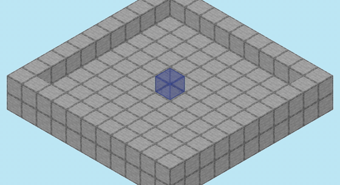
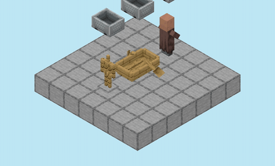
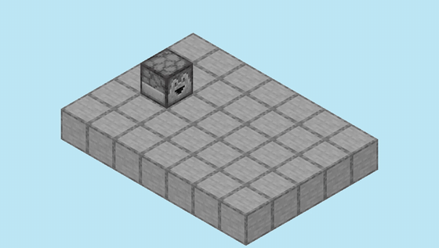
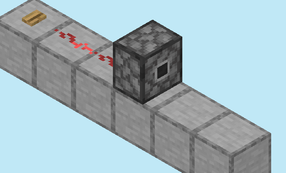

# Tick simulation

Build or load a scene and run it the way the game would — tick by tick, in the
game's own phase order — then read the results as data. This is
`TickSimulation`, backed by the `mc-tick` engine.

It is not the same tool as [redstone simulation](redstone-simulation.md), the
MCHPRS redpiler: that compiles a circuit for very fast logic evaluation. This
one is a faithful reimplementation of the game's tick loop, for when *order and
timing* are the answer — a piston door lives or dies on which of two opposed
pistons is notified first.

Two things to hold onto throughout:

- **Simulation is headless.** No window, no rendering feature, no game. It
  consumes a schematic and produces state you can query.
- **Rendering is a separate feature.** It consumes a schematic and produces
  pixels, and knows nothing about ticks. The two compose because the simulation
  can hand you its world as a schematic-shaped snapshot at any tick — see
  [Rendering a run](#rendering-a-run).

The engine is verified against captures of real Minecraft running headless;
when the two disagree, the capture wins and the engine is fixed. The depth
behind that sentence — version-gated entity loading, displacement laws,
measured hitboxes — lives in the
[mechanics notes](tick-simulation-mechanics.md).

## Quick start: build a scene, press the button

The examples on this page are Python (`pip install nucleation`). The same API
exists in JavaScript (camelCase, `BigInt` seeds, bytes in place of file paths),
PHP, C and Kotlin — see [bindings](bindings-and-languages.md).

```python
import json
from nucleation import Schematic, TickSimulation, TickSettleMode

# A scene from scratch: button -> dust -> sticky piston -> stone block.
scene = Schematic.create("piston_demo")
for x in range(6):
    scene.set_block(x, 0, 0, "minecraft:smooth_stone")
scene.set_block(0, 1, 0, "minecraft:oak_button[face=floor,facing=east,powered=false]")
scene.set_block(1, 1, 0, "minecraft:redstone_wire{simulate=true}")   # placed through the
scene.set_block(2, 1, 0, "minecraft:redstone_wire{simulate=true}")   # engine — see below
scene.set_block(3, 1, 0, "minecraft:sticky_piston[facing=east,extended=false]")
scene.set_block(4, 1, 0, "minecraft:stone")

sim = TickSimulation.from_schematic(scene, TickSettleMode.Placement, 0, 0, 0, "")

sim.use_block(0, 1, 0)          # press the button
sim.run(10)
print(sim.get_block(4, 1, 0))   # minecraft:piston_head[facing=east,...]
print(sim.get_block(5, 1, 0))   # minecraft:stone  — pushed one cell east

sim.run_until_quiescent(200)    # button pops, sticky piston pulls the block home
print(sim.get_block(4, 1, 0))   # minecraft:stone
print(sim.tick_count(), sim.changes_count())   # 32 30
```


That is the code above, animated: the `set_block` loop assembling the scene one
block at a time, then the simulation running — press, push, button pop,
retract. The wires were placed with a `{simulate=true}` tag, so the schematic
stores them already connected (`east=side`, `west=side`) instead of as bare
defaults — that tag is the next section.

## Placing through the engine

Writing full state strings — every wire connection, every `powered` flag — is
exact but tedious. The `{simulate=true}` brace tag hands the placement to the
tick engine instead: the schematic is treated as a world, and the block is
placed the way a hand would place it. Its state derives from the
neighbourhood, its `onPlace` runs, and whatever the placement genuinely
triggers is written back into the schematic:

```python
scene = Schematic.create("tagged")
for x in range(4):
    scene.set_block(x, 0, 0, "minecraft:smooth_stone")
scene.set_block(0, 1, 0, "minecraft:redstone_block")

scene.set_block(1, 1, 0, "minecraft:redstone_wire{simulate=true}")
# stored: redstone_wire[east=side,north=none,power=15,south=none,west=side]

scene.set_block(2, 1, 0, "minecraft:redstone_wire{simulate=true}")
# stored: power=14, connected west — and the first wire's shape updated too
```

The tag is not a connectivity heuristic — it is the real engine reacting, so
it covers whatever a placement covers. A repeater placed in front of power
comes back `powered=true`. And a piston placed where it is powered **really
extends**:

```python
scene.set_block(1, 1, 0, "minecraft:piston[facing=east,extended=false]{simulate=true}")
# stored: piston[extended=true,facing=east], with a piston_head in the next cell
```

If you want the piston stored retracted, place it unpowered — or without the
tag. The world runs to quiescence after the placement (capped at 255 ticks),
so anything the placement sets off — a repeater's delay, a piston stroke —
lands before the write-back.

Details worth knowing: the tag must stand alone in the braces (combine it with
`signal=` and the call is refused rather than half-honoured); a placement more
than three blocks from all other content skips the engine, since nothing is in
range to interact; and every block already in the schematic must be one the
engine can simulate, or the call errors by name.

Every block change carries its tick:

```python
for c in json.loads(sim.changes_json())[:3]:
    print(c["tick"], c["pos"], c["from"], "->", c["to"])
# 0 [0, 1, 0] minecraft:oak_button[...powered=false] -> ...powered=true
# 0 [1, 1, 0] minecraft:redstone_wire[...power=0]    -> ...power=15
# 0 [2, 1, 0] minecraft:redstone_wire[...power=0]    -> ...power=14
```

## Loading a real build

```python
schem = Schematic.load_from_file("my_machine.litematic")
sim = TickSimulation.from_schematic(schem, TickSettleMode.InWorld, 0, 0, 0, "")

sim.use_block(9, 2, 19)         # right-click its button
sim.run_until_quiescent(400)
```

The arguments after the schematic: a settle mode, a world origin (x, y, z), and
`extra_states`.

**Settle mode** answers "how did this build come to exist?" and is the most
consequential choice on this page:

| mode | models | use for |
|---|---|---|
| `InWorld` | the chunk was already loaded; saved state is trusted | a machine recorded where it stood — doors, latched memory |
| `Placement` | block-by-block placement with shape updates, like a structure paste | a build arriving in a world; observers pulse, derived state recomputes |
| `Quiet` | placement without the update storm | circuits assembled programmatically |

A machine saved at rest and loaded `InWorld` stays at rest; the same file under
`Placement` fires every observer in it — because a real paste genuinely does.
If a loaded build acts busy before you touch it, check this argument first.

**Origin** is where the build sits in the world. Vanilla's redstone update
order is *locational* (it hashes absolute positions), so two copies of one
build at different origins can order their updates differently. Pass the
coordinates the build really lived at when exactness matters.

**`extra_states`** pre-registers block states you plan to `place_block` later,
as a semicolon-separated list of descriptors. The engine wires behaviour only
for states it has seen; placing an unregistered state is a no-op.

Before trusting a file you did not save yourself:

```python
TickSimulation.block_entity_audit_json(schem)
# {"present":1,"missing_total":0,"missing":[],"summary":""}
```

Some exporters silently drop block entities; a comparator without its stored
output reads 0, and there is no error to catch — only this audit.

**Entities load too.** Items, minecarts, and the measured frozen-body kinds
(fireballs, blazes, villagers, boats, armor stands) come in with exact
positions and bit-exact IEEE-754 velocities — NaN included, which community
machines rely on as glue. Anything the engine cannot model **refuses to load,
by name**, rather than running a quietly wrong world. The loading rules and
what each kind actually does are in the
[mechanics notes](tick-simulation-mechanics.md#entities).

## Driving the clock

```python
sim.step()                       # one game tick
sim.run(80)                      # eighty
sim.run_until_quiescent(300)     # until nothing is pending, or the budget runs out
sim.is_quiescent()               # nothing scheduled, nothing queued
sim.tick_count()
```

`run_until_quiescent` returns whether the world actually settled. A machine
that never settles — a clock, a piston tape — exhausts its budget, which is
information rather than an error. Quiescent stretches are fast-forwarded, so
waiting out a long timer costs almost nothing.

Interact mid-run:

```python
sim.use_block(x, y, z)                       # right-click with an empty hand
sim.place_block(x, y, z, "minecraft:air")    # write a state (air breaks a block)
```

Levers, buttons and note blocks respond to `use_block`. To pulse a signal,
place `minecraft:redstone_block`, run a couple of ticks, place `minecraft:air`
over it.

## Reading state

Point queries return strings; structured data crosses the bindings as JSON.

```python
sim.get_block(x, y, z)     # "minecraft:sticky_piston[extended=true,facing=east]"
```

| call | gives you |
|---|---|
| `world_snapshot_json()` | every non-air block: `{"pos": [x,y,z], "state": …}` |
| `changes_json()` | every block change so far: tick, position, from, to |
| `changes_count()` | how many, without materialising them |
| `events_summary_json()` | per tick: block changes, piston events, redstone events |
| `item_entities_json()` | item entities, minecarts, frozen bodies — riders included |
| `motion_semantics()` | which `Entity.load` rule this run is using |

Snapshots omit air — absence means air, so diff two snapshots over the union
of their keys.

For search loops that cannot afford JSON there are scalar queries
(`non_air_count()`, `non_air_center_x()`, `non_air_min_x()`,
`non_air_max_x()`), and `eval_flight_batch` evaluates many flying-machine
candidates in one call.

### The sub-tick view

The engine can record every neighbour and shape update it delivers — the
dispatch-by-dispatch order *inside* a tick, which no snapshot can show:

```python
sim.record_updates(True)         # switch on before the stimulus, not after
sim.use_block(0, 1, 0)
sim.run(40)
heat = json.loads(sim.updates_heat_json(0, 40))   # per tick, per cell: counts
wave = json.loads(sim.updates_wave_json(2))       # one tick, in dispatch order
```

Each record carries the tick, an intra-tick sequence number, the position, the
update kind, the tick *phase* it was delivered in, and the block state at
dispatch time. The phase legend rides in the payload (`heat["phases"]`).
Prefer these views over raw `updates_json()` — one door cycle can be a hundred
thousand raw updates.

To see what "inside a tick" means, take a 13x13 carpet of redstone dust with a
button in the middle and press it. The button's press and the entire power
cascade — 11,784 update dispatches — happen inside game tick 0. This animation
is that *one tick*, played back in dispatch order:


The bright cursor is the engine delivering updates. Notice it does not bloom
outward from the button — dust hands out its updates in a position-hashed
order, the same locational ordering vanilla uses (and the reason the world
origin argument exists). The same run's totals, per cell:


## Small scenes

Three more scenes, each a handful of lines, each exercising a different part
of the engine.

### Water

Water is fully simulated — sources, flowing levels, falling columns, the
5-tick fluid cadence, the slope search toward holes. A source in a walled
basin fills it ring by ring:

```python
bowl = Schematic.create("bowl")
for x in range(11):
    for z in range(11):
        bowl.set_block(x, 0, z, "minecraft:smooth_stone")
        if x in (0, 10) or z in (0, 10):
            bowl.set_block(x, 1, z, "minecraft:smooth_stone")
bowl.set_block(5, 1, 5, "minecraft:water")

sim = TickSimulation.from_schematic(bowl, TickSettleMode.Placement, 0, 0, 0, "")
sim.run(60)
sum(1 for c in json.loads(sim.world_snapshot_json())
    if "water" in c["state"])                      # 77
```



Settle mode matters here too, instructively: the same file under `InWorld`
keeps its single still source — a saved world at rest has no fluid ticks
pending, and the engine trusts that. Under `Placement` the source is freshly
placed, schedules its first tick, and floods the basin.

### Entity hitboxes

Entity dimensions are measured out of the game's own registry and are load
bearing: drop a minecart onto three different bodies and it lands at three
different heights.

```python
scene = Schematic.create("drop_test")
for x in range(7):
    for z in range(7):
        scene.set_block(x, 0, z, "minecraft:smooth_stone")
for z, body in [(1, "villager"), (3, "oak_boat"), (5, "armor_stand")]:
    scene.add_entity_from_snbt(f'{{id: "minecraft:{body}", Pos: [3.5d, 1.0d, {z}.5d]}}')
    scene.add_entity_from_snbt(f'{{id: "minecraft:minecart", Pos: [3.5d, 4.5d, {z}.5d]}}')

sim = TickSimulation.from_schematic(scene, TickSettleMode.InWorld, 0, 0, 0, "")
sim.run(40)
for cart in json.loads(sim.item_entities_json())["minecarts"]:
    print(cart["pos"][2], cart["pos"][1])
# 1.5  2.950000047683716   — on the villager's head: 1.0 + 1.95f, in f32
# 3.5  1.5625              — resting in the oak boat
# 5.5  1                   — straight through the armor stand to the floor
```



The armor stand is a `LivingEntity` and still stops nothing — vanilla's
vehicle-collision predicate is what the engine implements, measured body by
body, not the "living things are solid" folklore. The eighth decimal on the
villager lane is real too: vanilla sizes a villager as `1.95F`, a float, and
the engine lands exactly there.

### Items

Item entities fly, fall, drag, land and merge. A dropper full of redstone,
a button, and sixty ticks:

```python
scene = Schematic.create("dropper_demo")
for x in range(7):
    for z in range(5):
        scene.set_block(x, 0, z, "minecraft:smooth_stone")
scene.set_block(1, 1, 2, "minecraft:dropper[facing=east,triggered=false]")
scene.set_block_entity(1, 1, 2, "minecraft:dropper",
    '{Items: [{Slot: 0b, id: "minecraft:redstone", count: 8}]}')
scene.set_block(0, 1, 2, "minecraft:oak_button[face=wall,facing=west,powered=false]")

sim = TickSimulation.from_schematic(scene, TickSettleMode.InWorld, 0, 0, 0, "")
sim.use_block(0, 1, 2)
sim.run(60)
json.loads(sim.item_entities_json())["items"]
# [{"item": "minecraft:redstone", "pos": [4.98, 1.0, 2.5], ...}]
```



Unseeded, the ejection uses the distribution's mean, so this scene lands the
item in the same spot every run; seed the RNG and it draws vanilla's actual
spread instead.

## Checkpoints

```python
saved = sim.checkpoint()
# ... try something ...
sim.restore(saved)
```

Cheap enough to sit inside a search loop. Measuring a door's reset time means
trying "toggle, wait N, toggle" for growing N — a checkpoint per trial makes
that nearly free. The same trick amortises setup in batch evaluation: wire an
empty world once, checkpoint, then restore-and-place per candidate.

## Determinism

Runs are deterministic. Behaviours that jitter in vanilla — dispenser
trajectories, drop velocities — use each distribution's mean unless seeded:

```python
sim.set_rng_seed(12345)
```

Seeded, they draw from a bit-exact `java.util.Random` in vanilla's own draw
order, so a seeded run reproduces vanilla exactly, bit for bit.

## Rendering a run

Rendering is its own feature — [meshing and rendering](meshing-and-rendering.md)
— and it operates on schematics, not simulations. The bridge between the two
is the snapshot: ask the simulation for its world at any moment, pour that
into a fresh schematic, and hand it to the renderer. The simulator never
draws; the renderer never ticks.

```python
from nucleation import RenderConfig, Renderer, ResourcePack

def snapshot_schematic(sim, name):
    frame = Schematic.create(name)
    for cell in json.loads(sim.world_snapshot_json()):
        x, y, z = cell["pos"]
        frame.set_block(x, y, z, cell["state"])
    return frame

pack = ResourcePack.from_bytes(open("client.jar", "rb").read())
cfg = RenderConfig.create(960, 540)
cfg.set_isometric()

sim = TickSimulation.from_schematic(scene, TickSettleMode.Placement, 0, 0, 0, "")
sim.use_block(0, 1, 0)
for i in range(12):
    sim.run(2)
    Renderer.render_to_file_with_pack(
        snapshot_schematic(sim, f"t{sim.tick_count()}"), pack, cfg,
        f"frame_{i:03}.png")
```

Twelve PNGs, one every two ticks; `ffmpeg -i frame_%03d.png out.mp4` turns
them into a clip. Any resource pack works — the vanilla client jar included.
This is the loop above, exactly as written:



For polished animations — smooth piston interpolation, entities drawn as their
real models, side-by-side comparison against a captured vanilla trace — there
is a Rust pipeline in `examples/render_simulation_video.rs`. It consumes a
block-change trace and an entity-position log, both of which
`examples/scenario_inspect.rs` dumps from an engine run (`--dump-trace`,
`--dump-entities`).

## Self-testing builds

A `.litematic` can carry its own scenario — press this, expect that — in an
embedded descriptor, and `cargo test --test litematic_cases` picks it up with
no code naming the build. A scenario can pin a build at rest, assert the fill
of a cell box after a press, or require the world to return bit-identical
after a full cycle. The vocabulary and workflow are in
[`tests/scenarios/README.md`](../../tests/scenarios/README.md); the engine's
own conformance suite runs the same way, diffed tick-for-tick against
captures of real Minecraft.

## Performance

Order of magnitude, small flying machine over 80 ticks: ~4,700 evals/sec per
browser wasm worker, ~6,500 via `eval_flight_batch` on node, ~700 per Python
process (~2,800 with `Pool(8)`). Quiescent machines fast-forward to roughly
30,000 evals/sec. Construction cost is amortised by the checkpoint-restore
pattern above.

## Limits

Stated plainly, because the alternative is discovering them as a wrong answer:

- **Mobs and players**: no AI, no pathing, no player physics. Mobs exist as
  measured frozen hitboxes — which is how record machines actually use them —
  and a mob carrying velocity refuses to load.
- **Item stack sizes**: everything stacks to 64, so comparator container reads
  are exact only for 64-stackable items.
- **Boats and armor stands** are measured obstacles, not vehicles.
- **A rider's velocity** reads as zero where vanilla reports a constant
  −0.0784.
- **Unimplemented things refuse to load** and name themselves — blocks, entity
  kinds, and modelled kinds carrying state nobody has implemented yet.

## Gotchas

- **A schematic is not always a valid world state.** Run
  `block_entity_audit_json` before suspecting the engine.
- **JSON flattens NaN.** Machines that depend on non-finite velocities survive
  SNBT round trips (`gametest_snbt` / `from_snbt`) but not a JSON hop. Details
  in [the mechanics notes](tick-simulation-mechanics.md#nan-velocities-and-the-version-gate).
- **A comparator emits what it stored**, not what its block state claims.
- **Riders nest.** `item_entities_json()` counts them; the top level of a
  saved entity list under-reports.
- **Settle mode and origin matter.** See [Loading](#loading-a-real-build).

## Where to look next

- [Mechanics notes](tick-simulation-mechanics.md) — the measured behaviour
  underneath this API: entity loading rules, piston displacement laws, the
  components that read entities.
- [`crates/mc-tick/README.md`](../../crates/mc-tick/README.md) — the engine
  crate itself: coverage, verification, Rust usage.
- [`crates/mc-tick/docs/history/`](../../crates/mc-tick/docs/history/) — the
  engineering record, including the record-door investigation.
