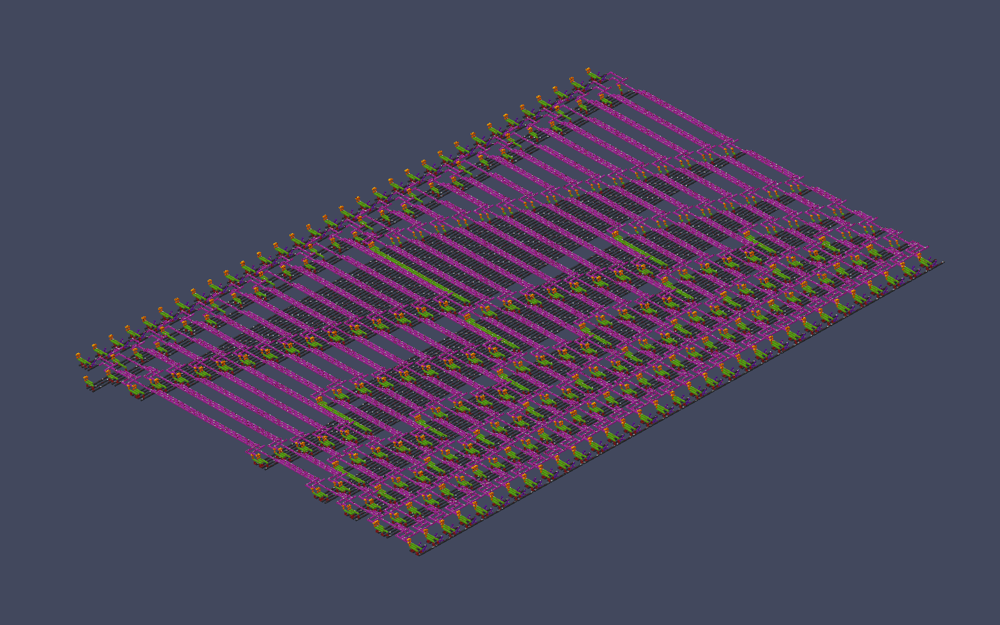
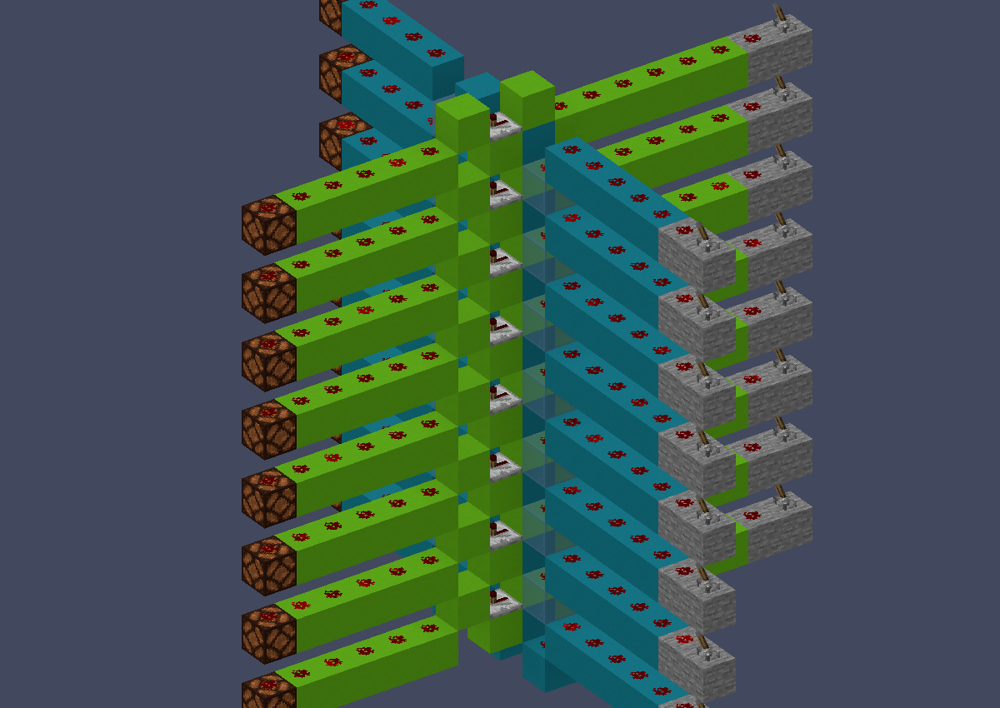
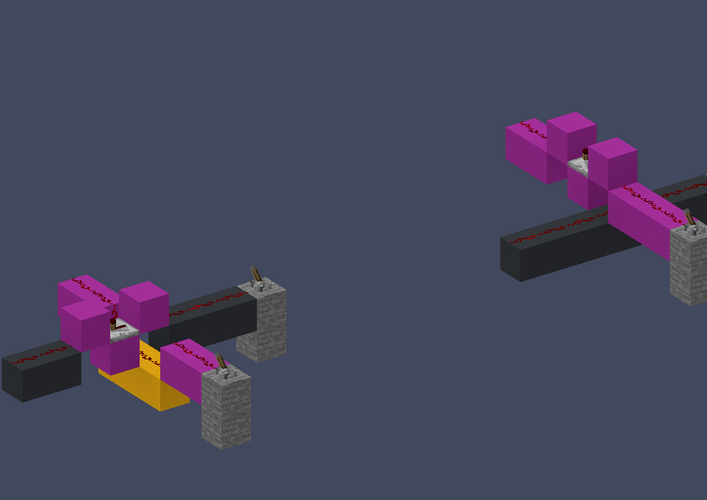
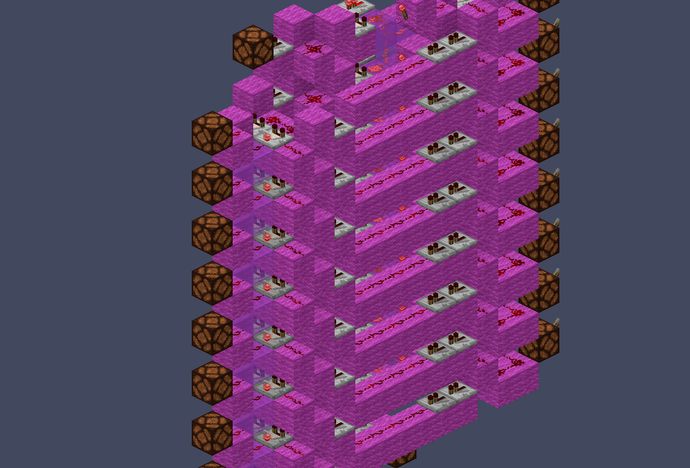
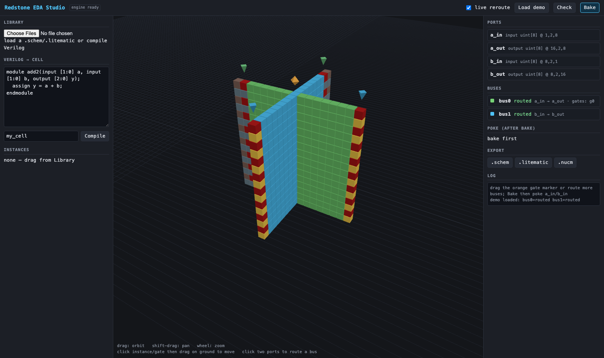
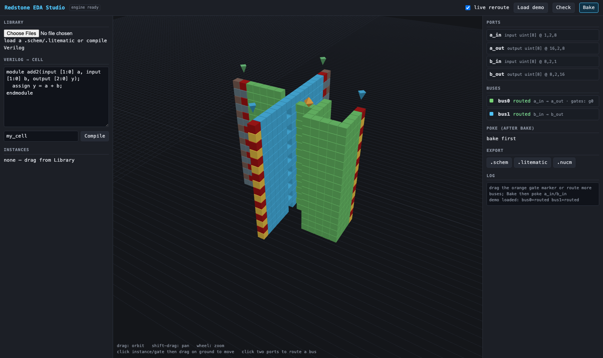
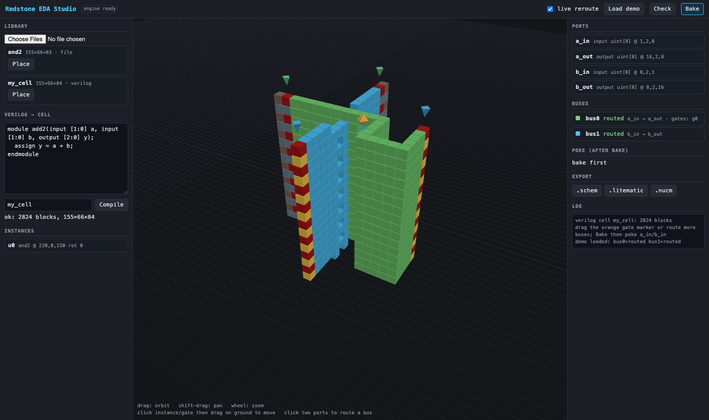

# Redstone EDA

**Electronic design automation for Minecraft redstone.** Verilog goes in; an
exhaustively simulator-verified `.schem` you can paste into a world comes out.

Three things live here, and they compose:

- **an HDL → redstone compiler** — yosys hands us BLIF, we hand back a placed,
  routed, verified build (combinational *and* sequential);
- **an interactive compositor** — a design document you place cells into and
  drag buses around, with electrical checks (DRC/LVS/STA) after every edit;
- **a verified cell library** — comparator cells, DFFs, bus stations, crossing
  and pivot tiles, each one probed in the simulator before anything is built
  on top of it.



*154,152 blocks of 32-bit Kogge-Stone prefix adder, emitted by the compiler and
verified over 54 cases. Every picture in this file is a direct render of the
tracked `.schem` — `docs/render_gallery.py` makes them.*

Every artifact in this tree was verified by its generator **before** it was
saved, in [mc-tick](../crates/mc-tick) (the vanilla-accurate tick simulator),
and is saved **baked at rest** — levers off, circuit quiescent, settled block
states written back. What you paste is exactly what the simulator proved.

---

## Quickstart

The `routing` and `hdl` features are **not** part of `bridge-full`; name them
explicitly or the wheel silently lacks the surface:

```sh
python3 -m venv ~/eda-venv
NUCLEATION_FEATURES="bridge-full,routing,hdl" ~/eda-venv/bin/pip install ./bindings/python
```

Then compile a circuit end to end (needs `yosys` on PATH — `brew install yosys`):

```sh
cd redstone-eda
~/eda-venv/bin/python hdl/hdl2redstone.py --verilog hdl/seg7.v --top seg7 --out hdl/seg7.schem
~/eda-venv/bin/python demos/demo1_route.py          # routing + DRC + conduction proof
~/eda-venv/bin/python docs/examples/run_all.py      # every example below, self-checking
```

`demos/README.md` has the wheel-build gotchas (stale vendored copy under
`bindings/python/rust/`, `EXTRA_STATES` interning, bounding-box traps).

---

## Examples

Every snippet below is a real file in [`docs/examples/`](docs/examples), each
one self-checking, all ten run green via `docs/examples/run_all.py`. They use
the **idiomatic veneer** (`nucleation.design`) — never raw JSON or positional
bridge calls. `lever_bank` / `lamp_bank` are the endpoint-hardware helpers from
[`_common.py`](docs/examples/_common.py).

### Compile combinational Verilog

[`01_verilog_comb.py`](docs/examples/01_verilog_comb.py)

```python
blif = open(synth(os.path.join(EDA, "hdl", "seg7.v"), "seg7")).read()

cell = n.Hdl.compile_blif(blif, "seg7", True)          # bake=True -> settled at rest
cell.set_cell_contract_json(n.Hdl.compile_blif_contract(blif, "seg7"))
cell.save_to_file(os.path.join(OUT, "seg7.schem"))

ex = n.design.Executor.for_schematic(cell)             # typed I/O, no coordinates
ex["d"] = 0x7
ex.settle()
assert ex["seg"] == 0b0000111, bin(ex["seg"])          # digit 7 -> segments a, b, c
```

The compiler emits a **`CellContract`** beside the schematic: ports grouped
back into typed words, each bit mapped to its drive lever or dust probe. Stamp
it into the schematic and the artifact is self-describing forever after.

### Compile *sequential* Verilog, then clock it

[`02_verilog_seq.py`](docs/examples/02_verilog_seq.py) — `always @(posedge clk)`
becomes a bank of the characterized master-slave DFF plus a clock spine.

```python
blif = open(synth(os.path.join(HDL_DATA, "counter4.v"), "counter4",
                  sequential=True)).read()          # yosys: + dffunmap

cell = n.Hdl.compile_blif(blif, "counter4", True)   # DFF bank + clock spine
cell.set_cell_contract_json(n.Hdl.compile_blif_contract(blif, "counter4"))

ex = n.design.Executor.for_schematic(cell)          # `clk` is a typed Boolean port
seen = []
for _ in range(6):
    seen.append(ex["q"])                            # init is baked by construction
    ex["clk"] = True;  ex.settle(400)               # rising edge
    ex["clk"] = False; ex.settle(400)
assert seen == [0, 1, 2, 3, 4, 5], seen
```

There is **no reset pin**: the initial state is authored into the slave
repeater's lock path, so the placement settle converges to the declared state
before any edge. The schematic *is* the reset state.

### Compose: place cells, route a bus, check, bake, save

[`03_compose.py`](docs/examples/03_compose.py)

```python
cell = n.Hdl.compile_blif(blif, "seg7", True)          # a cell needs a contract to be
cell.set_cell_contract_json(n.Hdl.compile_blif_contract(blif, "seg7"))   # placeable
keepout = json.loads(cell.cell_contract_json())["physical"]["keepouts"][0]
pitch = keepout["max"][2] - keepout["min"][2] + 8      # space instances by the keepout

d = n.Design.for_schematic("compose", s)
d.add_cell("seg7", cell)
d.place("u1", "seg7", at=(0, 0, 40))
d.place("u2", "seg7", at=(0, 0, 40 + pitch))
bus = d.route_bus("bus_a", driver="a_in", sinks=["a_out"])

d.check(strict=True)                                   # raises DesignCheckError if dirty
d.bake().save(os.path.join(OUT, "composed.schem"))     # settled in mc-tick, then written
```

Instances must be spaced by the contract's **keepout** — overlap them and
`check()` reports the shorts and repeater rings you just created rather than
letting them ship.

### Two buses that must cross

[`04_crossing.py`](docs/examples/04_crossing.py) — the 90° crossing is
**implicit**: declare perpendicular ports and the router stamps a verified
crossing tile.

```python
d.route_bus("bus_a", driver="a_in", sinks=["a_out"],
            style=n.Style(bus_block="minecraft:lime_concrete"))
d.route_bus("bus_b", driver="b_in", sinks=["b_out"],       # the router picks a crossing
            style=n.Style(bus_block="minecraft:cyan_concrete",
                          transparent_block="minecraft:cyan_stained_glass"))
d.check(strict=True)
ex = d.bake().executor()
ex["a_in"], ex["b_in"] = 0x55, 0xAA                        # both buses at once
ex.settle(400)
assert (ex["a_out"], ex["b_out"]) == (0x55, 0xAA)
```



Both crossing tile families, side by side — y-parity interpenetration (right)
and the glass dip-under (left):



### Typed execution

[`05_typed_exec.py`](docs/examples/05_typed_exec.py) — poke a saved artifact by
port name and word value; the contract rides in the `.schem` metadata.

```python
cell = n.Schematic.open(os.path.join(SHOWCASE, "bus_cross8_design.schem"))
ex = n.design.Executor.for_schematic(cell)     # contract read from the .schem metadata

ex["a_in"] = 0x55                              # ints convert to typed port Values
ex["b_in"] = 0xAA
ex.settle()                                    # run to quiescence in mc-tick
assert (ex["a_out"], ex["b_out"]) == (0x55, 0xAA)
```

### Somebody else's redstone, driven by name

[`06_community_cell.py`](docs/examples/06_community_cell.py) — a community build
from `computational_schematics/` with a contract embedded (originals untouched),
autodetected on open.

```python
s = n.Schematic.open(path)
found = json.loads(s.resolve_cell_contract_json())      # from .schem metadata
assert found["warnings"] == [], found["warnings"]

ex = n.design.Executor.for_schematic(s)                 # somebody else's redstone,
ex["a"], ex["b"] = 37, 5                                # driven by name
ex.settle()
assert ex["sum"] == 42, ex["sum"]
```



*ADD007, an 8-bit carry-cancel adder built by a player, now a typed cell.
`computational_schematics/enhanced/REPORT.md` has the full corpus analysis.*

### Reading the reports

[`07_reports.py`](docs/examples/07_reports.py) — DRC needs nothing but the
blocks; STA needs the intended gate netlist; LVS compares intent against
extracted conduction.

```python
violations = json.loads(n.Routing.drc(s, False))        # support, torches, decay, cycles
print("DRC: %d violations %s"
      % (len(violations), dict(Counter(v["kind"] for v in violations))))

sta = json.loads(n.Routing.sta(s, json.dumps(netlist)))
print("STA: cout arrives at %d rt, critical path %s"
      % (sta["arrival_rt"]["c4"], " -> ".join(sta["critical"])))
assert sta["arrival_rt"]["c4"] == 8
```

Prints `DRC: 0 violations {}` and a critical path of `cin -> c1 -> c2 -> c3 -> c4`
over the tracked 4-bit adder.

### Dragging, and what failure looks like

[`08_drag.py`](docs/examples/08_drag.py) — a gate drag rips **exactly** the two
adjacent segments. A move that cannot route leaves the bus visibly `failed:`,
never half-routed, and recovers when you drag the obstacle away.

```python
moved = bus.move_gate(0, (8, 2, 12))                 # drag g0 four cells south
assert moved["state"] == "routed" and moved["rerouted_segments"] == 2, moved

r = d.move_instance("c0", at=(4, 0, 12))             # drag it ONTO the corridor
assert "bus_a" in r["failed"] and bus.state.startswith("failed"), (r, bus.state)

r = d.move_instance("c0", at=(4, 0, 20))             # drag away: it re-attempts
assert r["rerouted"] == ["bus_a"] and d.check().clean, (r, bus.state)
```

The component move **always lands** — the document is the truth, and a bus that
cannot follow says so in red rather than quietly corrupting itself.

### Three serialization tiers

[`09_serialization.py`](docs/examples/09_serialization.py) — `.nucm` keeps the
whole project (reopens mid-edit), `.litematic` the layers, `.schem` the
flattened artifact. `save()` dispatches on the suffix.

```python
for suffix in (".nucm", ".litematic", ".schem"):        # save() dispatches on suffix
    d.save(os.path.join(OUT, "tiers" + suffix))

back = n.Design.load_nucm(os.path.join(OUT, "tiers.nucm"))   # project tier reopens
assert back.bus_state("bus_a") == "routed", back.bus_state("bus_a")
assert back.flatten().block_count() == d.flatten().block_count()
```

### The material model in five lines

[`10_materials.py`](docs/examples/10_materials.py) — materials are **computed**
from three predicates (`sturdy`, `conducts`, `cuts_diagonal`) and two laws, never
hardcoded. This is why glass appears only where a diagonal must survive.

```python
# A 1-y step passes power UP always, but DOWN only if the upper dust's support
# conducts -- so a descending line needs a CONDUCTOR under its upper cell.
assert m.step_conducts("minecraft:stone", downhill=True)
assert not m.step_conducts(m.GLASS, downhill=True)

# A block above dust only matters when that dust is the lower end of a diagonal
# in use; on a straight run a solid cap is harmless (so straight runs use SOLID).
assert m.cap_is_harmful("minecraft:stone", dust_uses_diagonal_here=True)
assert not m.cap_is_harmful("minecraft:stone", dust_uses_diagonal_here=False)
```

`pick_support()` turns a cell's constraints into a material and **refuses**
over-constrained geometry (must conduct *and* must not) — the build is wrong,
not the material. Full model: [`notes-material-model.md`](notes-material-model.md).

---

## Architecture

```
Verilog ──yosys──> BLIF ──┬─ PLA fabric  (dual-rail, QM covers, slice packing)
                          └─ genlib cells (abc -genlib onto verified cells)
                                     │
                          place + route (A* over the redstone fabric)
                                     │
                       DRC / LVS / STA  (static checks, before any sim)
                                     │
             mc-tick: exhaustive or sampled vs a pure-Python model
                                     │
                            bake at rest ──> .schem
```

| Layer | Where | What it is |
|---|---|---|
| `pnr-core` | [`crates/pnr-core`](../crates/pnr-core) | Fabric-agnostic P&R: grid A*, negotiated congestion, interval colouring, union-find net checks, annealing, generic STA |
| `nucleation-routing` | [`crates/nucleation-routing`](../crates/nucleation-routing) | The redstone fabric for `pnr-core`: design rules, via and pivot templates, signal budget, bus planner, DRC, STA |
| `nucleation-hdl` | [`crates/nucleation-hdl`](../crates/nucleation-hdl) | BLIF → build: parse/fold, Quine-McCluskey, peephole, levelise, slice packing, geometry, DFF banks, clock spine |
| `mc-tick` | [`crates/mc-tick`](../crates/mc-tick) | The vanilla-accurate tick simulator — the golden model everything is proved against |
| bridge | [`src/bridge/`](../src/bridge) | Generated `Routing` / `Hdl` / `Design` surfaces, JSON in/out, every language Nucleation ships |
| veneer | [`design.py`](../bindings/python/nucleation/design.py), [`design.mjs`](../bindings/npm/veneer/design.mjs) | Thin idiomatic overlay: keyword tuples, `Gate`/`Style`, `Bus` handles, `CheckReport`, `ex["a"]` sugar. Zero logic beyond marshalling; the two mirror each other 1:1 |
| Python toolchain | this directory | The executable spec: cell library, compilers, checkers, and the test vectors that gate everything |

The Python files remain the **specification** — the Rust ports are proved
against them (`hdl2redstone.py --rust` drives Rust-built geometry in the
simulator against the Python reference model). Full rationale, with every rule
paid for by a real in-sim bug: [`ROUTING_CRATE_DESIGN.md`](ROUTING_CRATE_DESIGN.md)
and [`DESIGN_SPEC.md`](DESIGN_SPEC.md).

---

## The gallery

**18 pieces, 221,785 blocks, 2,660 verification cases/checks.** Full
evidence table in [`showcase/README.md`](showcase/README.md); regenerate any
piece with `~/eda-venv/bin/python showcase/showcase_<name>.py` — each exits
non-zero unless its verification is perfect.

| Piece | Blocks | Demonstrates | Evidence |
|---|---|---|---|
| [`kogge_stone_32bit`](docs/img/kogge_stone_32bit.png) | 154,152 | Flagship: 32-bit prefix adder from the PLA compiler | 54/54 (47 random + 7 corners) |
| [`alu8`](docs/img/alu8.png) | 30,052 | 8-bit 4-op ALU (ADD/SUB/AND/XOR) | 144/144 |
| [`mult4x4_stacked`](docs/img/mult_4x4.png) | 27,222 | 4 stacked planes, 3D maze-routed inter-plane nets | exhaustive 256/256 |
| [`genlib_seg7`](docs/img/genlib_seg7.png) | 6,880 | Cell-mapped seg7: −20% blocks vs the PLA fabric | 16/16 exhaustive |
| [`genlib_cmp4`](docs/img/genlib_cmp4.png) | 3,560 | Cell-mapped cmp4: **3.9× smaller**, 43 → 28 rt | 256/256 exhaustive |
| [`ripple_carry_adder_4bit`](docs/img/ripple_carry_adder_4bit.png) | 3,362 | The routed 4-bit RCA | exhaustive |
| [`accumulator4`](docs/img/accumulator4.png) | 2,059 | Compositor MVP composition, clocked feedback | 24/24 clocked, DRC clean, LVS opens=0 |
| [`counter4`](docs/img/counter4.png) | 1,973 | The sequential loop closed: register + FA increment | 24 steps mod 16, min period 100 gt |
| [`adder4_cells`](docs/img/adder4_cells.png) / [`rca4_cells`](docs/img/rca4_cells.png) | 988 | Dense comparator-cell RCA, carry by abutment | exhaustive 512/512 |
| [`bus8_run`](docs/img/bus8_run.png) | 656 | Dense vertical bus: 8 bits, one block wide, zero glass | 96/96, zero crosstalk |
| [`hexanalog_trunk`](docs/img/hexanalog_trunk.png) | 556 | 4 bits on one wire's signal strength + decoder | encode/decode 16/16 exhaustive |
| [`bus_cross8_design`](docs/img/bus_cross8_design.png) | 512 | Two 8-bit buses, crossing implicit, via the Design API | 432/432 output checks |
| [`pivot_v2h`](docs/img/pivot_v2h.png) | 432 | Form-pivot adapter: vertical bus form → flat form, stamped by the router implicitly on a form mismatch | 96/96, zero crosstalk |
| [`register4`](docs/img/register4.png) | 280 | 4-bit register, clock chained by abutment | 16 write + 16 hold rounds |
| [`router_gallery`](docs/img/router_gallery.png) | 239 | Obstacle dive, vertical via, 3-net braid, shared-trunk fork | 7/7 conduct, braid isolation, DRC 0 |
| [`dff`](docs/img/dff.png) | 70 | MS rising-edge DFF from repeater locks | 11-pt protocol + 24 random steps, characterized |
| [`crossing_tiles`](docs/img/crossing_tiles.png) | 67 | Both 90° crossing tiles (y-parity, glass dip-under) | 4 combos × 2 tiles, conduction + isolation |

### Density: cells vs PLA

`abc -genlib` mapping onto the verified flat cell library — seven cells (torch
INV, comparator-subtract AND2/XOR2, repeater-join OR2, inverted tails), with
areas and delays taken from the measured fragments:

| design | fabric | blocks | bbox | crit path | verified |
|---|---|---|---|---|---|
| seg7 | PLA | 8,627 | 254×8×75 | 35 rt | 16/16 exhaustive |
| seg7 | genlib cells | **6,880** (−20%) | 128×7×100 | 30 rt | 16/16 exhaustive |
| cmp4 | PLA | 13,873 | 271×8×135 | 43 rt | 256/256 exhaustive |
| cmp4 | genlib cells | **3,560** (**3.9× smaller**) | 149×7×71 | **28 rt** | 256/256 exhaustive |

Read this honestly, because the scope is narrow:

- **Only seg7 and cmp4 were cell-mapped.** Two designs is not a trend.
- The 3.9× holds on cmp4, where the PLA's **dual-rail overhead dominates**.
  seg7 is a single dense truth table — the shape PLAs are *best* at — and gains
  only 20%.
- **Cell area is negligible** (≈800 and ≈560 blocks of actual cells). Routing is
  the fabric cost, so **channel geometry sets density**, not cell choice.
- `crit path` is **structural STA**, not a measured settle.

Running `pnr-core`'s annealer over the mapped seg7 placement bought a further
−1.7% wirelength, −1.3% blocks and 30 → 28 rt (16/16 green, seed 42).

---

## EDA Studio (browser)

A three.js compositor over the same engine compiled to wasm — see
[`apps/eda-studio`](../apps/eda-studio). Drag gates and components and watch
buses re-route live; compile Verilog client-side with YoWASP yosys; bake and
poke typed ports; export `.schem` / `.litematic` / `.nucm`.

| | |
|---|---|
|  |  |
| Two crossing 8-bit buses, per-bus colors | Gate drag — exactly two segments re-route |
|  |  |
| Bake, then poke typed ports | Verilog → cell, entirely in the browser |

```sh
NUCLEATION_WASM_FEATURES=bridge,simulation,mc-tick,routing,hdl ./tools/package-npm.sh dist/npm-eda
cd apps/eda-studio && npm install && npm run dev     # :8455, then press "Load demo"
npm run smoke                                        # 13 headless checks, node only
```

---

## Verification philosophy

Nothing here is trusted because it looks right.

- **Every artifact is gated.** Builders exit non-zero unless verification is
  perfect; the showcase wrappers parse the verification line and refuse
  anything short of a full score.
- **Per-node checking, not just outputs.** An open circuit is a perfectly
  quiescent circuit, so output-only checks pass dead builds. The HDL flow
  compares *every* rail and lane probe against a pure-Python evaluation of the
  prim graph, for every input assignment.
- **mc-tick is the golden model.** Static checks (DRC/LVS/STA) accelerate
  debugging, but conduction proofs run in the vanilla-accurate simulator — which
  is itself verified against captures from the game — and it has the final word.
- **Physics is probed, then generalized.** Each new fabric rule started as a
  real in-sim failure: the pointing law came from two pivot layouts failing at
  exactly their corner-entered stations. New physics enters as a predicate plus
  a law, not a special case.
- **Baked at rest.** Saved schematics carry their settled quiescent state and
  reload InWorld-quiescent in 0 gt.

---

## What's next / known gaps

The honest, prioritized list is [`IMPROVEMENTS.md`](IMPROVEMENTS.md). The parts
worth knowing before you build on this:

**Blocking or silently wrong (P1)**

- `route_all` does not handle air endpoints uniformly, and results depend on the
  order nets are submitted. Negotiated congestion exists in `pnr-core`, but the
  bridge path does not yet expose a deterministic, order-independent contract.
- `spacing` and `direction_bias` **parse and are then ignored** — accepting and
  silently dropping options is the worst of the available behaviours.
- The demo suite (demos 1–4, `rca_cells --bits 2`, seg7, `seq_probe`,
  accumulator) gates the whole stack, runs in minutes, and **is not in CI**.
- A stale venv wheel once silently lacked `Routing.lvs`, surfacing as an
  `AttributeError` 40 minutes into a run. Scripts should assert the bridge
  surface they need at import time.

**The cost model is not the verifier**

The annealer optimizes a cost model, and the cost model can be wrong: on mapped
seg7, seed 42 improved every metric and stayed 16/16, while a **lower-cost**
seed 7 realised only **7/16**. A better score is a hypothesis; the exhaustive
in-sim gate is the only trustworthy signal, which is exactly why every generator
refuses to save an artifact it has not proven.

**Limits on scale and quality (P2)**

- Bridge `sta` sees no net labels on a bare schematic, so per-net repeater
  delays contribute 0 through that path; label-aware STA needs the native
  `Workspace` bridged.
- LVS merges nets through components in ways the intended-netlist side does not
  expect — it needs a spelled-out per-component merge policy.
- The typed executor is re-implemented per binding (Python interprets the
  contract itself); a `TypedCell` opaque would remove the duplication.
- `delays_rt` in every contract is **estimated** (levelization depth × 2rt),
  not measured, and `drive_strength` is unmeasured.
- Still Python-only: the hand-written generators (Kogge-Stone netlist, ALU,
  multiplier) and the cell library.

**Known-missing, worth doing when touched (P3)**

- Clock distribution is abutment-chained (2 gt skew/bit); wide designs need a
  real tree with skew budgeting in STA.
- Multi-terminal nets are incremental joins, not Steiner trees.
- A *dense* pivot (interleaved 8-bit staircase at 1y separation) is
  over-constrained at aligned columns and needs the half-slope stagger; analog
  trunk corners are unprobed; codec packing for the analog bus form is open.
- Golden-file (or fingerprint) tests for the showcase `.schem`s would catch
  regressions without re-running the verification sweeps.

---

## Directory map

| Path | What |
|---|---|
| `hdl/` | The HDL flow: `hdl2redstone.py` (reference implementation), Verilog samples, `typed_demo.py` |
| `cells.py`, `seq_cells.py` | The verified cell library: comparator cells, latches, DFF |
| `router.py`, `nets.py`, `audit.py`, `timing.py` | Place-and-route and the static checkers (ported to `nucleation-routing`) |
| `materials.py`, `notes-material-model.md` | The predicate material model and its probe results |
| `pivot_tiles.py`, `pivot_tiles.md`, `crossing_tiles.py` | Bus-form adapters and crossing tiles |
| `genlib_map.py`, `anneal_genlib.py` | `abc -genlib` mapping onto the cell library |
| `compositor/` | The Design API acceptance demos (`design_demo2/3/4`) and compositions |
| `demos/` | The four introductory demos; `demos/README.md` has the wheel gotchas |
| `showcase/` | The tracked artifacts + their self-verifying generators |
| `docs/examples/` | The examples in this README, all self-checking |
| `docs/render_gallery.py` | Renders every picture in this README from the tracked `.schem`s |
| `TRICKS.md` | Techniques mined from the community corpus (T1–T11) |
| `DESIGN_SPEC.md`, `ROUTING_CRATE_DESIGN.md`, `CORE_PROPOSALS.md` | Design docs |
| `IMPROVEMENTS.md` | The honest, prioritized gap list |
